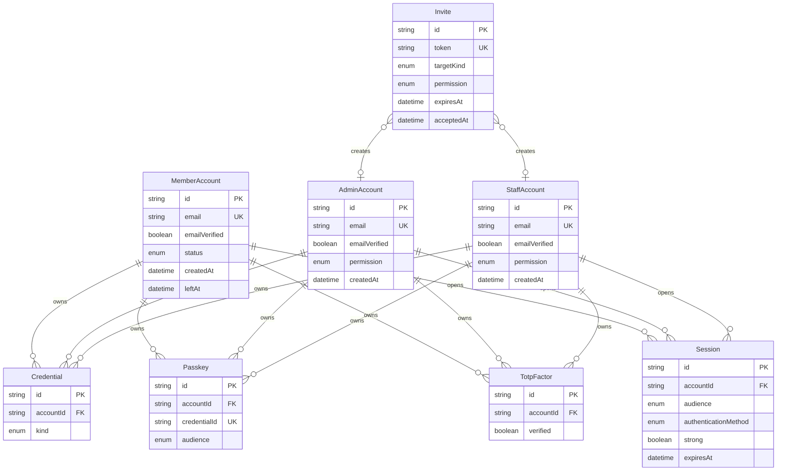

[[会員アカウント]]・[[管理者アカウント]]・[[社内アカウント]] は別の実体である。1 つの人物が複数の立場を持つときは、アカウントも複数持つ。利用者アプリの資格情報で管理者アプリや wiki には入れない。[[セッション]] と [[招待]] もこの境界に入る。

## ER 図

## 不変条件

- MemberAccount の `status` は `active` / `suspended` / `left` のどれか 1 つである。有料か無料かは [契約](/data-model/billing) の PlanSubscription が決める
- AdminAccount の `permission` は「閲覧のみ」「操作できる」「管理者を追加できる」のどれか 1 つで、招待のときに決まる
- StaffAccount の `permission` は「閲覧のみ」「変更できる」のどれか 1 つで、招待のときに決まる
- Session の `audience` は、そのアカウントが入れるアプリのうち、実際に開いたアプリと一致する
- 管理者アプリと wiki の管理操作に入れる Session は、パスキー、またはパスワードに認証アプリを重ねた認証だけを強い認証とする。バックアップコードだけの Session は強くない
- Invite の `targetKind` は `admin` か `staff` で、受け取り側のアプリが決まる。利用者の新規登録は Invite を使わない

## 画面

- 利用者の登録と確認: [新規登録](/pages/member-signup)
- 利用者のログイン: [ログイン](/pages/member-login)
- 管理者のログインと招待: [管理者のログイン](/pages/admin-login)、[管理者](/pages/admin-admins)
- 社内の利用者: [社内ダッシュボードのレイアウト](/pages/internal-dashboard-layout)
