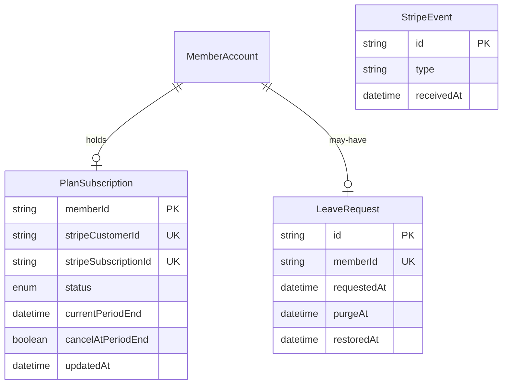

探すと最初のメッセージを有料にするための境界である。支払い事業者の明細の写しではない。

支払い事業者は Stripe で、プランは月額の 1 種類だけである。料金は Stripe 側の Price として持ち、アプリはその ID（`STRIPE_PRICE_ID`）だけを設定で受け取る。契約の開始は Stripe Checkout（subscription モード）、解約と支払い方法の変更は Stripe Billing Portal で行い、アプリは結果を Webhook で受け取る。

## ER 図

## 不変条件

- プランは `free` か `paid` の 2 つで、PlanSubscription からその場で導く。契約が無い MemberAccount は `free` である
- `status` は Stripe の subscription status（`active` / `trialing` / `past_due` / `canceled` など）をそのまま持つ。`active` か `trialing` で、`currentPeriodEnd` が未来（または未設定）のときだけ `paid` になる
- 有料かどうかの判定は `isPaidMember` / `requirePaid` の 1 か所で行い、画面・API キー・MCP のどの呼び出しもそこを通る。無料の会員が有料の操作を呼ぶと `PaidPlanRequired`（HTTP 402）で拒む
- 解約は Billing Portal で `cancelAtPeriodEnd` を立て、現在期間の末に Stripe が `customer.subscription.deleted` を送った時点で `free` に戻る。引き止めの段階は持たない
- StripeEvent は処理した Webhook の ID を持つ。同じ ID の通知が再び届いても何も変えない。古い通知が後から届いても、`updatedAt` より前の内容では上書きしない
- Stripe の設定（`STRIPE_SECRET_KEY` / `STRIPE_WEBHOOK_SECRET` / `STRIPE_PRICE_ID`）が無いと利用者アプリは起動時の設定検証で止まる。「設定が無ければ全員無料」という状態は無い。ローカル開発では test モードの鍵だけを受け付ける
- LeaveRequest を受け付けたら、会員データを `withdrawn_member` に移し、`user` から削除する。他の利用者からの参照を止める。`purgeAt` までの 30 日間だけ本人が `/recover` で復旧できる
- 管理者の停止（`suspended`）と退会（`left`）は別である。停止は契約を消さず、退会は契約を終える

## 画面

- [有料の案内](/pages/member-upgrade)
- [設定](/pages/member-settings)
- [利用者の詳細](/pages/admin-member-detail)
