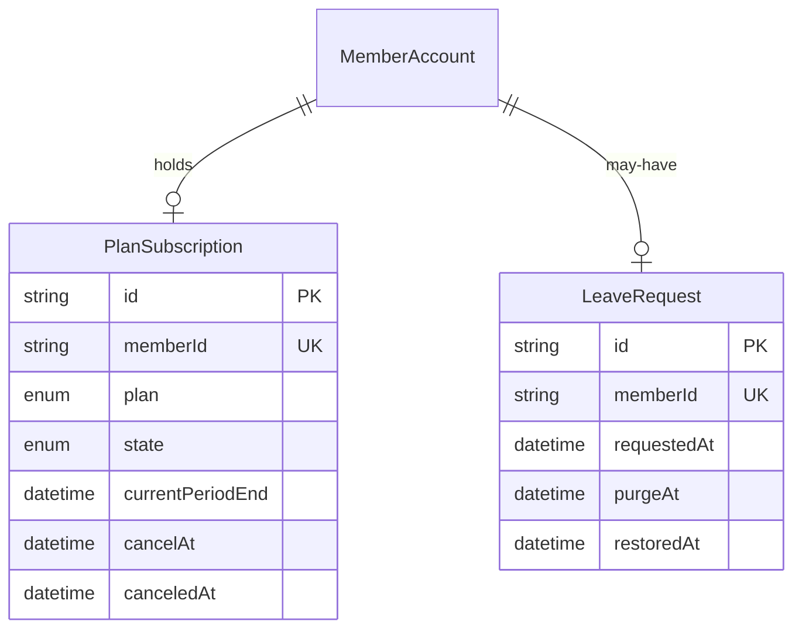

探すと最初のメッセージを有料にするための境界である。支払い事業者の明細の写しではない。

## ER 図

## 不変条件

- PlanSubscription の `plan` はいま `free` か `paid` である。契約が無い MemberAccount は `free` として扱う
- `state` が `active` の `paid` だけが、探すと最初のメッセージを使える
- 解約は `cancelAt` を現在期間の末に置き、その時点で `free` に戻る。引き止めの段階は持たない
- LeaveRequest を受け付けたら MemberAccount の `status` を `left` にし、他の利用者からの参照を止める。`purgeAt` までの 30 日間だけ本人が復旧できる
- 管理者の停止（`suspended`）と退会（`left`）は別である。停止は契約を消さず、退会は契約を終える

## 画面

- [有料の案内](/pages/member-upgrade)
- [設定](/pages/member-settings)
- [利用者の詳細](/pages/admin-member-detail)
