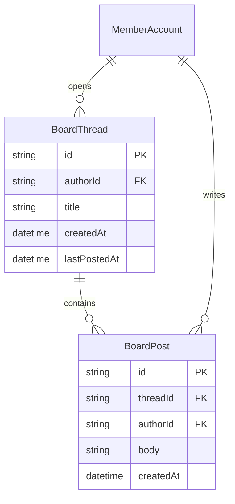

会員がトピックごとに書き込むための境界である。ホームのフィードが追う「動き」の 1 つでもある。

## ER 図

## 不変条件

- BoardThread を作ったとき、本文を持つ最初の BoardPost を同じ操作で 1 件作る
- スレッドの一覧は `lastPostedAt` の新しい順である
- 停止中・退会済みの著者の投稿は、スレッド上では「利用できない利用者」として出し、プロフィールへは進めない
- 自分をブロックしている利用者の新規スレッドと投稿は、自分の一覧と詳細に出さない
- 投稿の削除は著者本人か、管理者の処置だけが行う。削除した投稿の位置は空けず、削除済みであることを示す

## 画面

- [掲示板](/pages/member-board)
- [ホーム](/pages/member-home)
- [通知](/pages/member-notifications)
