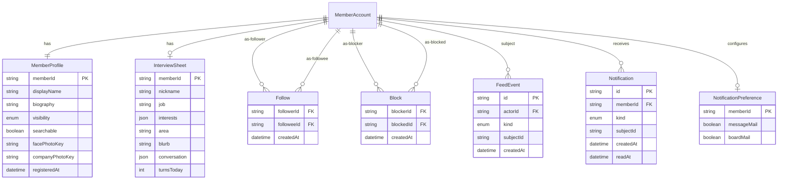

利用者が互いを知り、動きを追うための境界である。メールアドレスや認証の設定は、他の利用者向けの実体には載せない。

## ER 図

## 不変条件

- MemberProfile の `visibility` は「全会員」か「自分だけ」で、既定は全会員である。「全会員」でない利用者のプロフィールは、本人以外は開けない。誰のプロフィールを開けるかの判定は一箇所に置き、一覧・id 指定・ホームのフィード・写真の取得はすべてその判定を通す
- `facePhotoKey` と `companyPhotoKey` は写真の保存先の鍵で、写真そのものは会員アプリだけが掴む R2 バケットに置く。写真はプロフィールと同じ公開範囲の判定を通してだけ返す。保存する前に EXIF や位置情報などのメタデータを取り除き、差し替え・削除のときは古いオブジェクトも消す
- `searchable` の既定は偽である。探すに並ぶのは、メール確認済み・公開範囲が全会員・`searchable` が真・停止中でも退会済みでもない利用者だけである
- Follow は自分自身を指せない。Block がある組では、ブロックした側から見たフォローは成立しない
- 自分をブロックしている利用者のプロフィールは開けず、探すにも並ばない。開けないことと存在しないことは、表示から区別できない
- FeedEvent はホームに出す材料である。いま想定する `kind` は、プロフィールの更新・掲示板への投稿・フォローの開始である。会話の中身はフィードに出さない
- InterviewSheet は本人だけが読み書きする。他の利用者に見せるのは、保存後に MemberProfile へ写した自己紹介だけである
- Notification は本人だけが読む。メールで送るかは NotificationPreference が決め、既定はどちらも偽である

## 画面

- [プロフィール](/pages/member-profile)
- [探す](/pages/member-users)
- [ホーム](/pages/member-home)
- [通知](/pages/member-notifications)
- [AI インタビュー](/pages/member-interview)
- [設定](/pages/member-settings)
