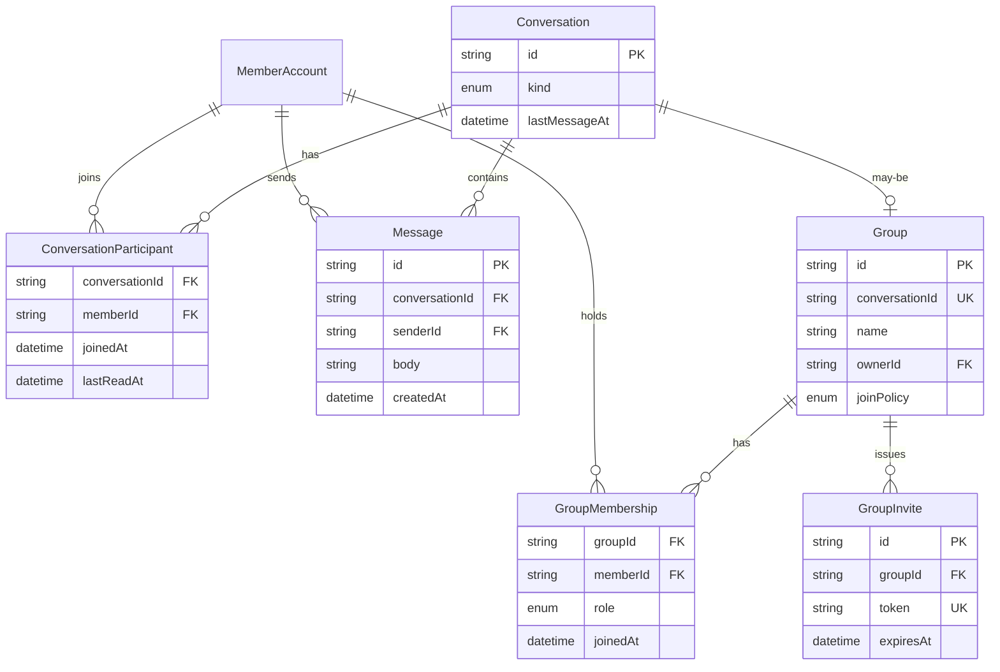

利用者がやり取りするための境界である。管理者アプリは会話の中身を読まない。

## ER 図

## 不変条件

- Conversation の `kind` は `direct` か `group` である
- `direct` の参加者は常に 2 人で、同じ 2 人の組に対する Conversation は 1 つまでである
- 無料の利用者が、まだメッセージの無い相手へ最初のメッセージを送ることはできない。届いたメッセージへの返信は無料でもできる
- 未読件数は、各 ConversationParticipant の `lastReadAt` より後の、自分以外の Message の件数である
- Group は 1 つの Conversation を裏に持つ。`joinPolicy` が `invite` のグループは、GroupInvite のリンクか既存メンバー経由での参加だけが、所有者以外の参加経路になる。`open` のグループは `/groups/{id}` から参加できる
- 招待制グループの会話とメンバー一覧は、参加していない会員にはどの API からも返さない
- ブロックしている相手との `direct` は新規に作れない。既存の Conversation は残るが、ブロック中は新しい Message を送れない

## 画面

- [メッセージ](/pages/member-messages)
- [グループ](/pages/member-groups)
- [有料の案内](/pages/member-upgrade)
