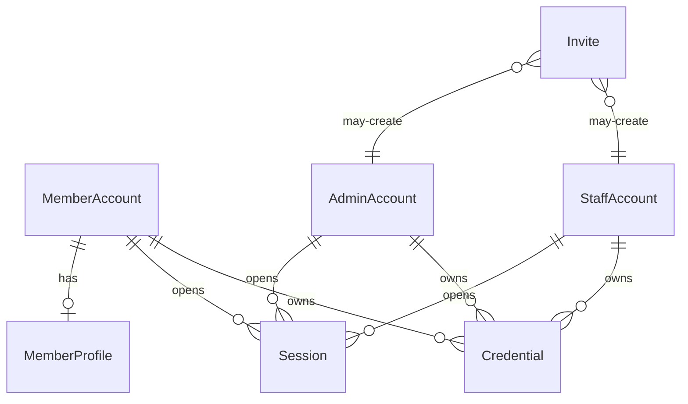
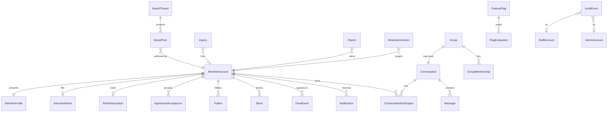

この節が持つのは、画面の仕様が前提にしている概念と関係である。表定義や ORM の写しではない。本格的な開発に取りかかるときは、この節ごと差し替え、自分のサービスの境界と語彙に置き換える。語彙の短い定義は [用語集](/glossary) が持ち、本文では `[[会員アカウント]]` のように参照する。

ページ構成の節が画面の振る舞いを持ち、この節が画面の背後にあるデータの境界を持つ。同じ概念を両方に詳しく書かない。画面側は操作と表示を、こちらは実体と関係と不変条件を持つ。

## 差し替え方

1. 自分のサービスの境界で、残す概念と捨てる概念を決める
2. この節の文書と [用語集](/glossary) を、残す概念の語彙と ER 図に書き換える
3. ページ構成の節のうち、捨てた概念に触れている画面の仕様を合わせて直す
4. 実装のスキーマは `libs/db` が持つ。文書の概念名と表名を機械で対応付けない

いまの実装は認証・プロフィール・探す・AI インタビューの島だけを永続化している。掲示板・メッセージ・契約・問い合わせなどは、画面の仕様が先にあり、永続化はまだ無い。

## アカウントの境界

利用者・運用担当・社内の人は、それぞれ別のアカウント領域を持つ。[[会員アカウント]]・[[管理者アカウント]]・[[社内アカウント]] を分け、同じ人が複数の立場を持つならアカウントも複数持つ。誰が何に触れるかは [アプリの役割](/getting-started/applications) が持つ。

## ドメインの関係

会員サービスの中核は、[[会員プロフィール]] を軸にしたつながりと、掲示板・メッセージ・契約・信頼・安全である。

## 節の分け方

| 文書 | 持つ境界 |
| --- | --- |
| [アカウント](/data-model/accounts) | 3 種のアカウント、認証手段、セッション、招待 |
| [会員のつながり](/data-model/member-graph) | プロフィール、フォロー、ブロック、フィード、インタビュー |
| [メッセージ](/data-model/messaging) | 会話、メッセージ、グループ |
| [掲示板](/data-model/board) | スレッド、投稿 |
| [契約](/data-model/billing) | プラン、解約、退会 |
| [信頼と安全](/data-model/trust) | 規約同意、問い合わせ、通報、処置 |
| [運営基盤](/data-model/platform) | 機能フラグ、監査、社内権限、集計の材料 |

## 画面との対応

ユースケースの入り口はページ構成の節にある。代表的な対応だけを示す。

| 概念 | 主な画面 |
| --- | --- |
| [[会員アカウント]] / 認証 | [新規登録](/pages/member-signup)、[ログイン](/pages/member-login) |
| [[会員プロフィール]] / [[フォロー]] / [[ブロック]] | [プロフィール](/pages/member-profile)、[探す](/pages/member-users)、[ホーム](/pages/member-home) |
| [[インタビューシート]] | [AI インタビュー](/pages/member-interview) |
| [[会話]] / [[メッセージ]] / [[グループ]] | [メッセージ](/pages/member-messages)、[グループ](/pages/member-groups) |
| [[スレッド]] / [[投稿]] | [掲示板](/pages/member-board) |
| [[通知]] | [通知](/pages/member-notifications) |
| [[契約]] | [有料の案内](/pages/member-upgrade)、[プランと解約](/pages/member-settings) |
| [[規約の版]] | [規約への同意](/pages/member-agreement) |
| [[問い合わせ]] | [お問い合わせ](/pages/member-contact)、[会員のお問い合わせ](/pages/member-support)、[管理者の問い合わせ](/pages/admin-inquiries) |
| [[通報]] / [[処置]] | [通報](/pages/admin-reports)、[利用者の詳細](/pages/admin-member-detail) |
