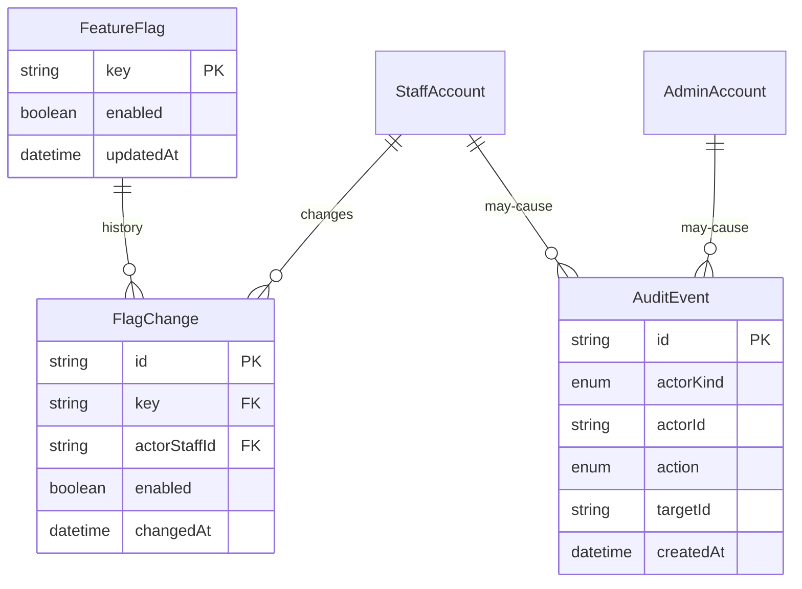

社内ダッシュボードが読む運営用の境界である。個人を特定できる値は、問い合わせのように利用者 ID で個別に引く必要があるものだけに限る。

## ER 図

## 不変条件

- FeatureFlag の切り替えは StaffAccount の「変更できる」権限だけが行う。FlagChange を残さずに `enabled` を変えない
- AuditEvent の `action` は、少なくとも管理者の権限変更・利用者の削除・停止と解除・規約の公開・機能フラグの切り替え（`flag_toggled`、targetId は `キー:変更前:変更後`）を含む
- 機能フラグの定義は Cloudflare Flagship に置き、Alchemy の `flagship` stack で宣言する。評価は OpenFeature（`@openfeature/server-sdk`）と Flagship プロバイダー（`@cloudflare/flagship`）経由で行う
- 概要の集計は、会員数・有料会員数・問い合わせの未対応件数・通報の未対応件数を、個人を特定できない形で出す
- wiki の文書本体と MCP の許可は、この境界の外にある。MCP のクライアントへの許可は [アカウント](/data-model/accounts) の Session と OAuth の同意に任せる

## 画面

- [社内ダッシュボードのレイアウト](/pages/internal-dashboard-layout)
- [管理者](/pages/admin-admins)
