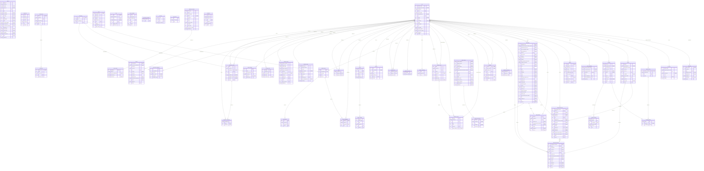

`libs/db` の Drizzle スキーマから生成した、D1 に実在する表と外部キーの ER 図である。この文書は手で直さず、`vp run --filter @repo/db db:generate` で作り直す。

```mermaid
erDiagram
  account {
    text access_token "nullable"
    integer access_token_expires_at "nullable"
    text account_id
    integer created_at
    text id PK
    text id_token "nullable"
    text password "nullable"
    text provider_id
    text refresh_token "nullable"
    integer refresh_token_expires_at "nullable"
    text scope "nullable"
    integer updated_at
    text user_id FK
  }
  agreement_acceptance {
    integer accepted_at
    text user_id PK, FK
    text version_id PK, FK
  }
  agreement_version {
    text body
    integer created_at
    text created_by FK "nullable"
    text id PK
    text kind
    integer published_at "nullable"
    text published_by FK "nullable"
    text summary "nullable"
    text version UK
  }
  ai_usage_event {
    text identifier PK
    text member_id FK
    integer occurred_at
    integer quantity
    integer reported_at "nullable"
  }
  apikey {
    text config_id
    integer created_at
    integer enabled "nullable"
    integer expires_at "nullable"
    text id PK
    text key
    integer last_refill_at "nullable"
    integer last_request "nullable"
    text metadata "nullable"
    text name "nullable"
    text permissions "nullable"
    text prefix "nullable"
    integer rate_limit_enabled "nullable"
    integer rate_limit_max "nullable"
    integer rate_limit_time_window "nullable"
    text reference_id
    integer refill_amount "nullable"
    integer refill_interval "nullable"
    integer remaining "nullable"
    integer request_count "nullable"
    text start "nullable"
    integer updated_at
  }
  audit_event {
    text action
    text actor_id
    text actor_kind
    text channel
    integer created_at
    text id PK
    text target_id
  }
  board_post {
    text author_id "nullable"
    text body
    integer created_at
    text id PK
    text thread_id FK
  }
  board_thread {
    text author_id "nullable"
    integer created_at
    text id PK
    integer last_posted_at
    integer post_count
    text title
  }
  conversation {
    text direct_key UK "nullable"
    text kind
    integer last_message_at
    text id PK
  }
  conversation_participant {
    text id PK
    text conversation_id FK
    integer joined_at
    integer last_read_at "nullable"
    text member_id FK "nullable"
    text member_name
  }
  customer_invoice {
    integer amount_credited
    integer amount_due
    integer amount_paid
    integer amount_refunded
    integer amount_remaining
    text currency
    text hosted_invoice_url "nullable"
    integer issued_at
    text member_id FK
    text origin_key UK
    text status
    text stripe_invoice_id PK
    integer updated_at
  }
  customer_quote {
    integer amount_total
    text collection_method
    text currency
    integer days_until_due "nullable"
    integer expires_at
    text member_id FK
    text status
    text stripe_quote_id PK
    text stripe_subscription_id "nullable"
    integer updated_at
  }
  direct_message {
    text id PK
    text body
    text conversation_id FK
    integer created_at
    text sender_id FK "nullable"
    text sender_name
  }
  follow {
    integer created_at
    text followee_id PK, FK
    text follower_id PK, FK
  }
  group_invite {
    text id PK
    integer expires_at
    text group_id FK
    text token UK
  }
  group_membership {
    text group_id PK, FK
    integer joined_at
    text member_id PK, FK
    text role
  }
  inquiry {
    integer created_at
    text id PK
    text member_id FK
    text status
    text subject
    integer updated_at
  }
  inquiry_message {
    text author_id
    text author_kind
    text body
    integer created_at
    text id PK
    text inquiry_id FK
  }
  interview {
    text day
    text saved_sheet "nullable"
    text state
    integer turns
    integer updated_at
    text user_id PK, FK
    integer version
  }
  invite {
    integer accepted_at "nullable"
    text audience
    integer created_at
    text email
    integer expires_at
    text id PK
    text inviter_id
    text permission
    text token_hash UK
  }
  jwks {
    text alg "nullable"
    integer created_at
    text crv "nullable"
    integer expires_at "nullable"
    text id PK
    text private_key
    text public_key
  }
  leave_request {
    text member_id PK, FK
    integer purge_at
    integer recovery_declined_at "nullable"
    integer requested_at
    integer restored_at "nullable"
  }
  member_block {
    text blocked_id PK, FK
    text blocker_id PK, FK
    integer created_at
  }
  member_group {
    text id PK
    text conversation_id FK, UK
    text join_policy
    text name
    text owner_id FK
  }
  member_mcp_grant {
    text capability PK
    text member_id PK, FK
  }
  member_onboarding {
    text step
    integer updated_at
    text user_id PK, FK
  }
  member_report {
    text body
    integer created_at
    text id PK
    text reason
    text reporter_id FK "nullable"
    text status
    text subject_id
    text subject_kind
    text target_member_id FK "nullable"
  }
  metric_snapshot {
    text bucket
    text client_kind
    integer computed_at
    text id PK
    text metric
    text period
    integer value
  }
  moderation_action {
    text actor_id FK
    integer created_at
    text id PK
    text kind
    text note
    text report_id FK
    text target_member_id FK "nullable"
  }
  notification {
    text actor_id FK "nullable"
    text actor_name "nullable"
    integer created_at
    text id PK
    text kind
    text member_id FK
    integer read_at "nullable"
    text subject_id
    text title "nullable"
  }
  notification_preference {
    integer board_mail
    text member_id PK, FK
    integer message_mail
  }
  oauth_access_token {
    text authorization_code_id "nullable"
    text client_id FK
    text confirmation "nullable"
    integer created_at "nullable"
    integer expires_at "nullable"
    text id PK
    text reference_id "nullable"
    text requested_user_info_claims "nullable"
    text resources "nullable"
    integer revoked "nullable"
    text scopes
    text session_id FK "nullable"
    text refresh_id FK "nullable"
    text token UK "nullable"
    text user_id FK "nullable"
  }
  oauth_client {
    text application_type "nullable"
    integer backchannel_logout_session_required "nullable"
    text backchannel_logout_uri "nullable"
    text client_credentials_scopes "nullable"
    text client_discovery_id "nullable"
    text client_id UK
    text client_secret "nullable"
    text contacts "nullable"
    integer created_at "nullable"
    integer disabled "nullable"
    integer dpop_bound_access_tokens "nullable"
    integer enable_end_session "nullable"
    text grant_types "nullable"
    text icon "nullable"
    text id PK
    text jwks "nullable"
    text jwks_uri "nullable"
    text metadata "nullable"
    text name "nullable"
    text policy "nullable"
    text post_logout_redirect_uris "nullable"
    text redirect_uris
    text reference_id "nullable"
    integer require_pkce "nullable"
    text response_types "nullable"
    text scopes "nullable"
    integer skip_consent "nullable"
    text software_id "nullable"
    text software_statement "nullable"
    text software_version "nullable"
    text subject_type "nullable"
    text token_endpoint_auth_method "nullable"
    text tos "nullable"
    integer updated_at "nullable"
    text uri "nullable"
    text user_id FK "nullable"
  }
  oauth_client_assertion {
    integer expires_at
    text id PK
  }
  oauth_client_resource {
    text client_id FK
    integer created_at "nullable"
    text id PK
    text metadata "nullable"
    text resource_id FK
  }
  oauth_consent {
    text client_id FK
    integer created_at "nullable"
    text id PK
    text reference_id "nullable"
    text requested_user_info_claims "nullable"
    text resources "nullable"
    text scopes
    integer updated_at "nullable"
    text user_id FK "nullable"
  }
  oauth_refresh_token {
    text authorization_code_id "nullable"
    text client_id FK
    text confirmation "nullable"
    integer created_at "nullable"
    integer expires_at "nullable"
    text id PK
    text reference_id "nullable"
    text requested_user_info_claims "nullable"
    text resources "nullable"
    integer revoked "nullable"
    text scopes
    text session_id FK "nullable"
    integer auth_time "nullable"
    integer rotated_at "nullable"
    integer rotation_replay_expires_at "nullable"
    text rotation_replay_response "nullable"
    text token UK
    text user_id FK
  }
  oauth_resource {
    integer access_token_ttl "nullable"
    text allowed_scopes "nullable"
    integer created_at "nullable"
    text custom_claims "nullable"
    integer disabled "nullable"
    integer dpop_bound_access_tokens_required "nullable"
    text id PK
    text identifier UK
    text metadata "nullable"
    text name
    integer policy_version "nullable"
    integer refresh_token_ttl "nullable"
    text signing_algorithm "nullable"
    text signing_key_id "nullable"
    integer updated_at "nullable"
  }
  passkey {
    text aaguid "nullable"
    text audience
    integer backed_up
    integer counter
    integer created_at "nullable"
    text credential_id UK
    text device_type
    text id PK
    text name "nullable"
    text public_key
    text transports "nullable"
    text user_id FK
  }
  plan_subscription {
    integer cancel_at_period_end
    integer current_period_end "nullable"
    integer current_period_start "nullable"
    text member_id PK, FK
    text status
    text stripe_customer_id UK
    text stripe_subscription_id UK
    integer updated_at
  }
  rate_limit {
    integer count
    text id PK
    text key UK
    integer last_request
  }
  recording {
    integer byte_size
    integer completed_at "nullable"
    text content_type
    integer created_at
    integer duration_ms "nullable"
    text failure "nullable"
    text id PK
    text job_id UK
    text object_key
    text owner_id FK "nullable"
    text status
    text title
  }
  recording_segment {
    integer end_ms
    integer position PK
    text recording_id PK, FK
    integer speaker_label
    integer start_ms
    text text
  }
  recording_speaker {
    integer label PK
    text person_id FK "nullable"
    text recording_id PK, FK
  }
  session {
    text audience
    integer authenticated_at "nullable"
    text authentication_method
    integer created_at
    integer expires_at
    text id PK
    text ip_address "nullable"
    integer security_version
    text token UK
    integer updated_at
    text user_agent "nullable"
    text user_id FK
  }
  speaker_person {
    text consent_recorded_by FK "nullable"
    integer consented_at
    text id PK
    text name
  }
  stripe_event {
    text id PK
    integer received_at
    text type
  }
  two_factor {
    text backup_codes
    integer failed_verification_count
    text id PK
    integer locked_until "nullable"
    text secret
    text user_id FK, UK
    integer verified
  }
  user {
    text account_state
    text company_photo_key "nullable"
    integer created_at
    text email UK
    integer email_verified
    text face_photo_key "nullable"
    text id PK
    text image "nullable"
    text name
    text permission "nullable"
    text profile
    text social_links
    text role
    integer searchable
    integer security_version
    integer two_factor_enabled
    integer updated_at
    text visibility
  }
  verification {
    text audience
    integer created_at
    integer expires_at
    text id PK
    text identifier
    integer updated_at
    text value
  }
  wiki_draft {
    text base_revision "nullable"
    text markdown
    text path PK
    text published_revision "nullable"
    text published_url "nullable"
    integer updated_at
    text updated_by FK "nullable"
    integer version
  }
  withdrawn_member {
    integer created_at
    text email
    integer email_verified
    text image "nullable"
    text member_id PK
    text name
    text profile
    integer security_version
    text snapshot
    text social_links
    integer two_factor_enabled
    integer withdrawn_at
  }
  user ||--o{ account : "user_id"
  user ||--o{ agreement_acceptance : "user_id"
  agreement_version ||--o{ agreement_acceptance : "version_id"
  user |o--o{ agreement_version : "created_by"
  user |o--o{ agreement_version : "published_by"
  user ||--o{ ai_usage_event : "member_id"
  board_thread ||--o{ board_post : "thread_id"
  conversation ||--o{ conversation_participant : "conversation_id"
  user |o--o{ conversation_participant : "member_id"
  user ||--o{ customer_invoice : "member_id"
  user ||--o{ customer_quote : "member_id"
  conversation ||--o{ direct_message : "conversation_id"
  user |o--o{ direct_message : "sender_id"
  user ||--o{ follow : "followee_id"
  user ||--o{ follow : "follower_id"
  member_group ||--o{ group_invite : "group_id"
  member_group ||--o{ group_membership : "group_id"
  user ||--o{ group_membership : "member_id"
  user ||--o{ inquiry : "member_id"
  inquiry ||--o{ inquiry_message : "inquiry_id"
  user ||--o| interview : "user_id"
  withdrawn_member ||--o| leave_request : "member_id"
  user ||--o{ member_block : "blocked_id"
  user ||--o{ member_block : "blocker_id"
  conversation ||--o| member_group : "conversation_id"
  user ||--o{ member_group : "owner_id"
  user ||--o{ member_mcp_grant : "member_id"
  user ||--o| member_onboarding : "user_id"
  user |o--o{ member_report : "reporter_id"
  user |o--o{ member_report : "target_member_id"
  user ||--o{ moderation_action : "actor_id"
  member_report ||--o{ moderation_action : "report_id"
  user |o--o{ moderation_action : "target_member_id"
  user |o--o{ notification : "actor_id"
  user ||--o{ notification : "member_id"
  user ||--o| notification_preference : "member_id"
  oauth_client ||--o{ oauth_access_token : "client_id"
  session |o--o{ oauth_access_token : "session_id"
  oauth_refresh_token |o--o{ oauth_access_token : "refresh_id"
  user |o--o{ oauth_access_token : "user_id"
  user |o--o{ oauth_client : "user_id"
  oauth_client ||--o{ oauth_client_resource : "client_id"
  oauth_resource ||--o{ oauth_client_resource : "resource_id"
  oauth_client ||--o{ oauth_consent : "client_id"
  user |o--o{ oauth_consent : "user_id"
  oauth_client ||--o{ oauth_refresh_token : "client_id"
  session |o--o{ oauth_refresh_token : "session_id"
  user ||--o{ oauth_refresh_token : "user_id"
  user ||--o{ passkey : "user_id"
  user ||--o| plan_subscription : "member_id"
  user |o--o{ recording : "owner_id"
  recording ||--o{ recording_segment : "recording_id"
  speaker_person |o--o{ recording_speaker : "person_id"
  recording ||--o{ recording_speaker : "recording_id"
  user ||--o{ session : "user_id"
  user |o--o{ speaker_person : "consent_recorded_by"
  user ||--o| two_factor : "user_id"
  user |o--o{ wiki_draft : "updated_by"
```
