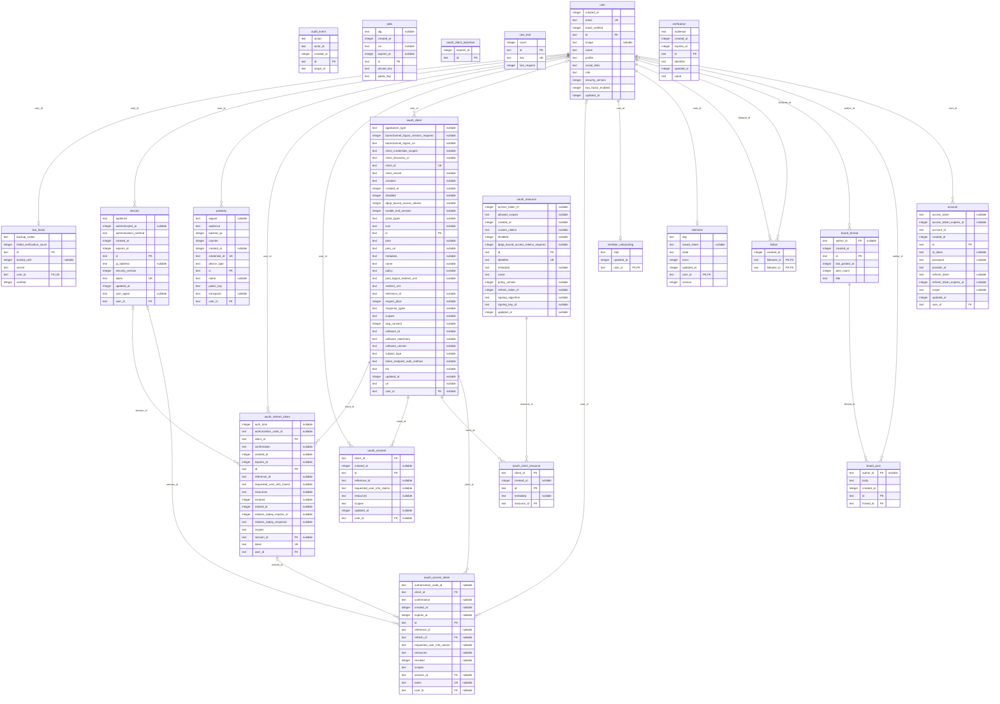

`libs/db` の Drizzle スキーマから生成した、D1 に実在する表と外部キーの ER 図である。概念の関係は [データモデルの全体](/data-model/overview) が持つ。この文書は手で直さず、`vp run --filter @repo/db db:generate` で作り直す。

```mermaid
erDiagram
  account {
    text access_token "nullable"
    integer access_token_expires_at "nullable"
    text account_id
    integer created_at
    text id PK
    text id_token "nullable"
    text password "nullable"
    text provider_id
    text refresh_token "nullable"
    integer refresh_token_expires_at "nullable"
    text scope "nullable"
    integer updated_at
    text user_id FK
  }
  audit_event {
    text action
    text actor_id
    integer created_at
    text id PK
    text target_id
  }
  board_post {
    text author_id FK "nullable"
    text body
    integer created_at
    text id PK
    text thread_id FK
  }
  board_thread {
    text author_id FK "nullable"
    integer created_at
    text id PK
    integer last_posted_at
    integer post_count
    text title
  }
  follow {
    integer created_at
    text followee_id PK, FK
    text follower_id PK, FK
  }
  interview {
    text day
    text saved_sheet "nullable"
    text state
    integer turns
    integer updated_at
    text user_id PK, FK
    integer version
  }
  jwks {
    text alg "nullable"
    integer created_at
    text crv "nullable"
    integer expires_at "nullable"
    text id PK
    text private_key
    text public_key
  }
  member_onboarding {
    text step
    integer updated_at
    text user_id PK, FK
  }
  oauth_access_token {
    text authorization_code_id "nullable"
    text client_id FK
    text confirmation "nullable"
    integer created_at "nullable"
    integer expires_at "nullable"
    text id PK
    text reference_id "nullable"
    text refresh_id FK "nullable"
    text requested_user_info_claims "nullable"
    text resources "nullable"
    integer revoked "nullable"
    text scopes
    text session_id FK "nullable"
    text token UK "nullable"
    text user_id FK "nullable"
  }
  oauth_client {
    text application_type "nullable"
    integer backchannel_logout_session_required "nullable"
    text backchannel_logout_uri "nullable"
    text client_credentials_scopes "nullable"
    text client_discovery_id "nullable"
    text client_id UK
    text client_secret "nullable"
    text contacts "nullable"
    integer created_at "nullable"
    integer disabled "nullable"
    integer dpop_bound_access_tokens "nullable"
    integer enable_end_session "nullable"
    text grant_types "nullable"
    text icon "nullable"
    text id PK
    text jwks "nullable"
    text jwks_uri "nullable"
    text metadata "nullable"
    text name "nullable"
    text policy "nullable"
    text post_logout_redirect_uris "nullable"
    text redirect_uris
    text reference_id "nullable"
    integer require_pkce "nullable"
    text response_types "nullable"
    text scopes "nullable"
    integer skip_consent "nullable"
    text software_id "nullable"
    text software_statement "nullable"
    text software_version "nullable"
    text subject_type "nullable"
    text token_endpoint_auth_method "nullable"
    text tos "nullable"
    integer updated_at "nullable"
    text uri "nullable"
    text user_id FK "nullable"
  }
  oauth_client_assertion {
    integer expires_at
    text id PK
  }
  oauth_client_resource {
    text client_id FK
    integer created_at "nullable"
    text id PK
    text metadata "nullable"
    text resource_id FK
  }
  oauth_consent {
    text client_id FK
    integer created_at "nullable"
    text id PK
    text reference_id "nullable"
    text requested_user_info_claims "nullable"
    text resources "nullable"
    text scopes
    integer updated_at "nullable"
    text user_id FK "nullable"
  }
  oauth_refresh_token {
    integer auth_time "nullable"
    text authorization_code_id "nullable"
    text client_id FK
    text confirmation "nullable"
    integer created_at "nullable"
    integer expires_at "nullable"
    text id PK
    text reference_id "nullable"
    text requested_user_info_claims "nullable"
    text resources "nullable"
    integer revoked "nullable"
    integer rotated_at "nullable"
    integer rotation_replay_expires_at "nullable"
    text rotation_replay_response "nullable"
    text scopes
    text session_id FK "nullable"
    text token UK
    text user_id FK
  }
  oauth_resource {
    integer access_token_ttl "nullable"
    text allowed_scopes "nullable"
    integer created_at "nullable"
    text custom_claims "nullable"
    integer disabled "nullable"
    integer dpop_bound_access_tokens_required "nullable"
    text id PK
    text identifier UK
    text metadata "nullable"
    text name
    integer policy_version "nullable"
    integer refresh_token_ttl "nullable"
    text signing_algorithm "nullable"
    text signing_key_id "nullable"
    integer updated_at "nullable"
  }
  passkey {
    text aaguid "nullable"
    text audience
    integer backed_up
    integer counter
    integer created_at "nullable"
    text credential_id UK
    text device_type
    text id PK
    text name "nullable"
    text public_key
    text transports "nullable"
    text user_id FK
  }
  rate_limit {
    integer count
    text id PK
    text key UK
    integer last_request
  }
  session {
    text audience
    integer authenticated_at "nullable"
    text authentication_method
    integer created_at
    integer expires_at
    text id PK
    text ip_address "nullable"
    integer security_version
    text token UK
    integer updated_at
    text user_agent "nullable"
    text user_id FK
  }
  two_factor {
    text backup_codes
    integer failed_verification_count
    text id PK
    integer locked_until "nullable"
    text secret
    text user_id FK, UK
    integer verified
  }
  user {
    integer created_at
    text email UK
    integer email_verified
    text id PK
    text image "nullable"
    text name
    text profile
    text social_links
    text role
    integer security_version
    integer two_factor_enabled
    integer updated_at
  }
  verification {
    text audience
    integer created_at
    integer expires_at
    text id PK
    text identifier
    integer updated_at
    text value
  }
  user ||--o{ account : "user_id"
  user |o--o{ board_post : "author_id"
  board_thread ||--o{ board_post : "thread_id"
  user |o--o{ board_thread : "author_id"
  user ||--o{ follow : "followee_id"
  user ||--o{ follow : "follower_id"
  user ||--o| interview : "user_id"
  user ||--o| member_onboarding : "user_id"
  oauth_client ||--o{ oauth_access_token : "client_id"
  oauth_refresh_token |o--o{ oauth_access_token : "refresh_id"
  session |o--o{ oauth_access_token : "session_id"
  user |o--o{ oauth_access_token : "user_id"
  user |o--o{ oauth_client : "user_id"
  oauth_client ||--o{ oauth_client_resource : "client_id"
  oauth_resource ||--o{ oauth_client_resource : "resource_id"
  oauth_client ||--o{ oauth_consent : "client_id"
  user |o--o{ oauth_consent : "user_id"
  oauth_client ||--o{ oauth_refresh_token : "client_id"
  session |o--o{ oauth_refresh_token : "session_id"
  user ||--o{ oauth_refresh_token : "user_id"
  user ||--o{ passkey : "user_id"
  user ||--o{ session : "user_id"
  user ||--o| two_factor : "user_id"
```
