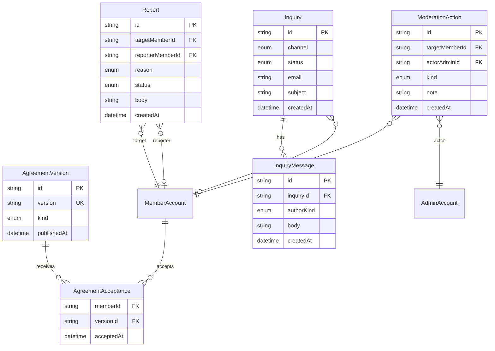

規約への同意と、問い合わせ・通報・利用者への処置の境界である。会話の中身はここにも載せない。

## ER 図

## 不変条件

- AgreementVersion の `kind` は `terms` か `privacy` である。会員が再同意を求められるのは、公開済みの最新 `terms` に未同意のときだけである
- 公開の `/contact` から来る Inquiry は MemberAccount を持たないことがある。会員の `/support` から来る Inquiry は MemberAccount を必ず持つ
- Inquiry への返信は管理者アプリだけが書く。wiki は読むだけで InquiryMessage を足さない
- Report の `status` は `open` / `actioned` / `dismissed` である。処置したら対応する ModerationAction を 1 件以上残す
- ModerationAction の `kind` は少なくとも `suspend` / `unsuspend` / `warn` を持つ。停止と解除は MemberAccount の `status` と同時に変わる

## 画面

- [規約への同意](/pages/member-agreement)
- [お問い合わせ](/pages/member-contact)
- [会員のお問い合わせ](/pages/member-support)
- [管理者の問い合わせ](/pages/admin-inquiries)
- [通報](/pages/admin-reports)
- [利用者の詳細](/pages/admin-member-detail)
- [規約](/pages/admin-terms)
