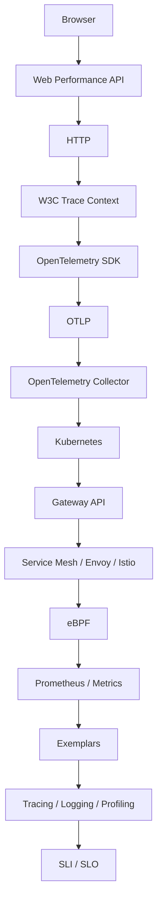

この節は、ブラウザで起きた一つの操作が、計測、伝播、収集、保存を経て目標の数値になるまでの層を、上から順に持つ。何を記録するかと深刻さは [観測性](/guidelines/observability) が持つ。このテンプレートで span を切って OTLP へ出す手順は [OpenTelemetry](/tech-stack/opentelemetry) が持つ。

## ページ

- [Browser](/observability/browser) — 利用者の時計と、ページが持つ計時
- [Web Performance API](/observability/web-performance-api) — LCP、INP、Resource Timing
- [HTTP](/observability/http) — 要求と応答、`Server-Timing`
- [W3C Trace Context](/observability/trace-context) — `traceparent`
- [OpenTelemetry SDK](/observability/opentelemetry-sdk) — `startSpan`、Semantic Conventions、sampling
- [OTLP](/observability/otlp) — `/v1/traces` への POST
- [OpenTelemetry Collector](/observability/collector) — receiver、tail sampling
- [Kubernetes](/observability/kubernetes) — Pod と、ノード上の Collector
- [Gateway API](/observability/gateway-api) — 外から入る `HTTPRoute`
- [Service Mesh](/observability/service-mesh) — Envoy と Istio
- [eBPF](/observability/ebpf) — プロセスを書き換えずに見る
- [Prometheus](/observability/prometheus) — p99、Histogram、ラベルの cardinality
- [Exemplars](/observability/exemplars) — メトリクスの一点から trace id へ
- [Tracing / Logging / Profiling](/observability/signals) — 同じ trace id、flame graph
- [SLI / SLO](/observability/sli-slo) — RED、USE、誤り予算、burn rate
