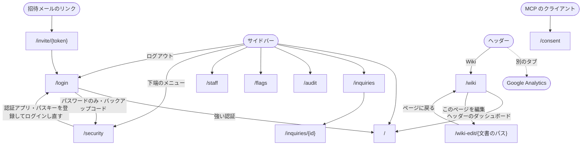

wiki のページは、ナビゲーションを持たない枠、ダッシュボードの枠、Wiki の枠のどれか 1 つに入る。ダッシュボードの枠と Wiki の枠は、強い認証を済ませた社内の利用者にしか表示しない。

社内の利用者の権限は「閲覧のみ」「変更できる」の 2 段階で、社内の利用者を招待するときに決める。社内の利用者は会員・管理者とは別のアカウントで、自分で新規登録はできない。最初の 1 人は DB のブートストラップで作り、それ以降は「変更できる」利用者の招待でだけ増える。

## ナビゲーションを持たない枠

ログイン・招待の受け取り・MCP のクライアントへの許可に使う。1 つの作業だけを画面中央に置く。

| ページ                     | パス              |
| -------------------------- | ----------------- |
| ログイン                   | `/login`          |
| 招待を受ける               | `/invite/{token}` |
| MCP のクライアントへの許可 | `/consent`        |

- MCP のクライアントへの許可はログインしている社内の利用者だけが使え、ログインしていなければ `/login?redirect=開こうとしたパス` へ移る
- 招待を受けるでは、招待されたメールアドレスを確認し、名前とパスワードを入れてアカウントを作る。招待の有効期限は 7 日で、1 回受け取ると同じリンクは使えない。切れている・使われているリンクでは再送の依頼を促す

## ダッシュボードの枠

サービスの状況を見るページと、社内の利用者の管理に使う。形は [管理者アプリの管理操作の枠](/pages/admin-layout#管理操作の枠) と同じで、違うのは次の点である。

- サイドバーの上端のアプリ名は「社内ダッシュボード」
- 本体の枠のヘッダーの右に、Google Analytics の画面を別のタブで開くリンクと、Wiki の枠へ移る「Wiki」を置く
- Wiki はサイドバーの項目に入れない

| ページ | パス | サイドバー | 閲覧のみ | 変更できる |
| --- | --- | --- | --- | --- |
| 概要 | `/` | 状況・概要 | 見る | 見る |
| 問い合わせ | `/inquiries`・`/inquiries/{id}` | 状況・問い合わせ | 見る | 見る |
| 監査ログ | `/audit` | 状況・監査ログ | 見る | 見る |
| 機能フラグ | `/flags` | 運営・機能フラグ | 見る（一覧と現在値） | 見る・切り替え（`requireFlagEditor` で制御。現状は社内ダッシュボードのセッションがあれば切り替え可。#297 で閲覧のみを拒否） |
| メンバー（社内の利用者の一覧） | `/staff` | 運営・メンバー | 出さない | 見る・操作 |
| セキュリティ | `/security` | 下端のメニュー | 見る・操作 | 見る・操作 |
| Wiki の編集 | `/wiki-edit/{文書のパス}` | 出さない | 見る・下書きの保存と破棄 | 見る・下書きの保存と破棄 |

- 概要には、会員数・有料会員数・メッセージ数などの集計カードと、直近 30 日の日次推移を置く。集計は 30 分ごとに D1 へ書き込み、個人を特定できる値は返さない
- 監査ログは操作・操作者 ID・対象 ID・日時だけを一覧し、絞り込みできる。メールアドレスや氏名は返さない
- 問い合わせは読むだけで、返信は管理者アプリで行う
- MCP から `overview_metrics`・`metric_trend`・`audit_log` で集計と監査ログを読める
- 「出さない」ページは、サイドバーに項目を出さず、パスを直接開いたときは権限が無いことを示す。サーバー側の書き込み API も同じ権限で拒む
- メンバーは、名前・メールアドレス・権限・登録日の表と「招待する」からなる。権限の列で権限を変え、行末の操作で自分以外の利用者を削除する。最後の「変更できる」利用者は下げられず、削除もできない。招待・権限の変更・削除は [監査イベント](/glossary/audit-event) に残す

## Wiki の枠

文書を読むのに使い、`/wiki` とその下のパスで開く。ダッシュボードの枠とはページの作りが別で、サイドバーを持たない。

- ヘッダー
  - 左に「Wiki」を置き、Wiki の先頭へのリンクにする
  - 右に、文書の検索と、ダッシュボードの枠へ戻る「ダッシュボード」を置く
- 左に文書の木、中央に本文を置く
- 本文の説明の下に「このページを編集」を置き、その文書の Wiki の編集へ移る
- 画面幅が狭いときは、文書の木を閉じておき、ヘッダーのメニューボタンで開く

## Wiki の編集

文書を書き換えるページで、ダッシュボードの枠に入る。書き換えた内容は下書きとして保存し、公開されている文書は変えない。

- 見出しは「{文書のタイトル} を編集」
- 上から、タイトル、説明、書式のボタン、本文、操作のボタンを置く
- 書式のボタンは、見出し・小見出し・太字・コード・箇条書き・番号付き・引用・コードブロック・画像
- 画像は PNG・JPEG・GIF・WebP の 5MB までを受け付け、本文のカーソルの位置に入れる。それ以外の形式や大きさは、入れずに理由を出す
- 操作のボタンは「下書きを保存」「下書きを捨てる」「ページに戻る」。「下書きを捨てる」は下書きがあるときだけ出し、確認を経てから捨てる
- 下書きがある文書を開いたときは下書きを出し、公開されたページがまだ変わっていないことを示す
- ほかの人が先に同じ文書の下書きを保存していたときは、保存せずに再読み込みを促す

## 枠へ入る条件

ダッシュボードの枠と Wiki の枠へ入る条件は、[管理者アプリの枠へ入る条件](/pages/admin-layout#枠へ入る条件) と同じで、違うのは次の点である。

- `redirect` に置けるのは wiki 内のパスだけで、それ以外の値は概要として扱う
- セキュリティは、強い認証の前でも表示する

## 遷移図

