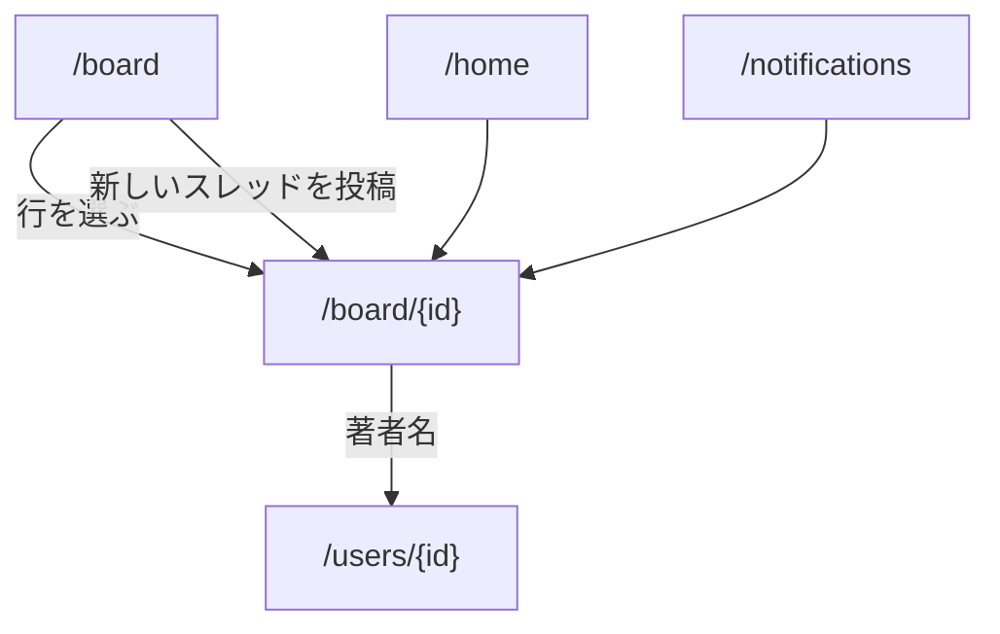

パスは 2 つある。どちらも [会員の枠](/pages/member-layout#会員の枠) に入る。

- `/board`: タブ「掲示板」から開く一覧
- `/board/{id}`: 一覧・通知・ホームから開くスレッド

実体は [掲示板](/data-model/board) が持つ。

## 一覧

### 構成

上から次の順に置く。

1. 見出し「掲示板」
2. 「新しいスレッド」ボタン
3. スレッドの行の並び（最終投稿の新しい順）
4. ページ送り

行には題、著者のユーザー名、最終投稿の日時、投稿数を置き、行全体をそのスレッドへのリンクにする。

### 新しいスレッド

「新しいスレッド」で同じページ内に入力を出す。

1. 題の入力欄（100 文字まで）
2. 本文の入力欄（5,000 文字まで）
3. 「投稿する」と「やめる」

成功したら作ったスレッドへ移る。

## スレッド

### 構成

上から次の順に置く。

1. 題
2. 投稿の並び（古い順）
3. 返信の入力欄と「投稿する」

各投稿には、著者のアバターとユーザー名、本文、日時を置く。ユーザー名はプロフィールへのリンクにする。削除済みの投稿は本文の代わりに「削除されました」を出す。

- 著者本人の投稿には「削除」を出す。確認のあと削除済みにする
- 自分をブロックしている利用者の投稿は出さない
- 停止中・退会済みの著者は「利用できない利用者」とし、プロフィールへ進めない

## 状態ごとの表示

| 状態                              | 表示                                                   |
| --------------------------------- | ------------------------------------------------------ |
| 読み込み中                        | 枠を保ったまま読み込み中の表示を出す                   |
| スレッドが無い                    | 「まだスレッドはありません」と「新しいスレッド」を出す |
| 存在しない id・見られないスレッド | 見つからないことと掲示板へのリンクを出す               |
| 投稿に失敗した                    | 入力を残したまま理由を出す                             |

## 遷移

