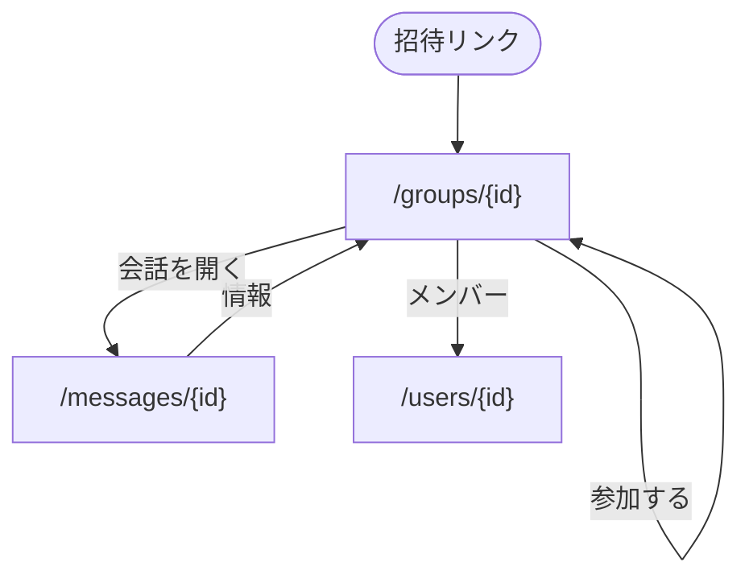

パス: `/groups/{id}`。[会員の枠](/pages/member-layout#会員の枠) に入る。会話の「情報」と、グループの招待リンクから開く。

実体は [メッセージ](/data-model/messaging) の Group が持つ。

## 構成

上から次の順に置く。

1. グループ名
2. 所有者のユーザー名
3. メンバー数
4. 操作
   - 参加していない: 「参加する」
   - 参加している: 「会話を開く」「招待リンクをコピー」。所有者には「グループ名を変更」
   - 参加していて所有者でない: 「退席する」
5. メンバーの一覧（ユーザー名の新しい参加順）

- 招待リンクの期限が切れているときは、参加の代わりに期限切れであることを出す
- メンバーの行はプロフィールへのリンクにする

## 状態ごとの表示

| 状態 | 表示 |
| --- | --- |
| 読み込み中 | 枠を保ったまま読み込み中の表示を出す |
| 存在しない id・無効な招待 | 見つからないこととホームへのリンクを出す |
| 参加・退席に失敗した | 理由を本体の下に出す |

## 遷移

