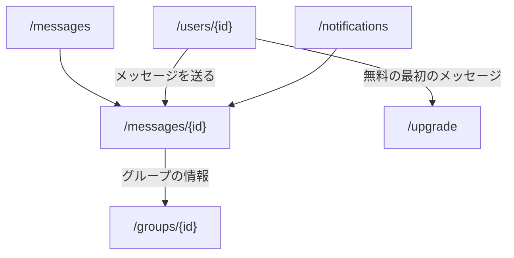

パスは 2 つある。どちらも [会員の枠](/pages/member-layout#会員の枠) に入る。

- `/messages`: タブ「メッセージ」から開く一覧
- `/messages/{id}`: 一覧・プロフィール・通知から開く会話

実体は [メッセージ](/data-model/messaging) が持つ。無料の利用者が、まだやり取りの無い相手へ最初のメッセージを送ろうとしたときは [有料の案内](/pages/member-upgrade) へ移る。

## 一覧

### 構成

上から次の順に置く。

1. 見出し「メッセージ」
2. 会話の行の並び（最終メッセージの新しい順）

行には次を置く。

- 相手のアバター（グループならグループ名の頭文字）
- 相手のユーザー名、またはグループ名
- 最終メッセージの先頭 1 行
- 未読なら未読の印

行全体をその会話へのリンクにする。

## 会話

### 構成

メッセージアプリのトーク画面の形にする。

- 上端: 相手のユーザー名（グループならグループ名）と、グループのときは「情報」
- 中央: メッセージ。自分を右、相手を左の吹き出しにし、新しいものが下に足される
- 下端: 入力欄と送信ボタン

- 「情報」は `/groups/{id}` へ移る
- ブロック中の相手には入力欄の代わりに、送れないことを出す
- プロフィールの「メッセージを送る」から来て、まだ Conversation が無いときは、送信に成功した時点で Conversation を作る

## 状態ごとの表示

| 状態                              | 表示                                   |
| --------------------------------- | -------------------------------------- |
| 読み込み中                        | 枠を保ったまま読み込み中の表示を出す   |
| 会話が 1 件も無い                 | 「まだメッセージはありません」を出す   |
| 存在しない id・参加していない会話 | 見つからないことと一覧へのリンクを出す |
| 送信に失敗した                    | 入力を残したまま理由を出す             |
| 無料で最初のメッセージを送れない  | `/upgrade` へ移る                      |

## 遷移

