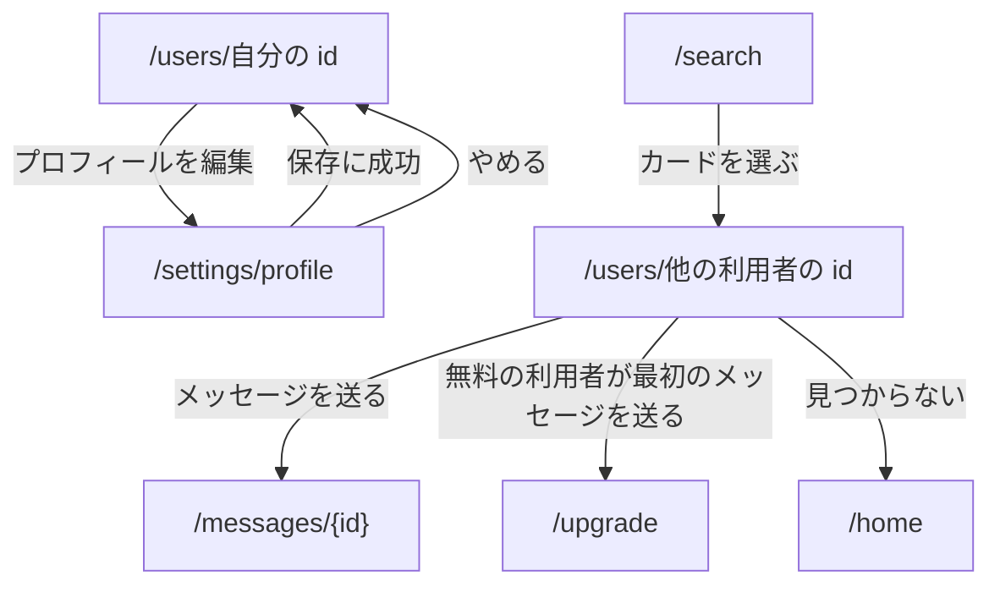

## プロフィール

パス: `/users/{id}`。[会員の枠](/pages/member-layout#会員の枠) に入る。自分のプロフィールは、自分のアイコンのメニューから開く。

プロフィールを直せるのは本人だけである。他の利用者のプロフィールには、編集する操作を出さない。

### 構成

上から次の順に置く。

1. アバター（顔写真。無いときは名前の頭文字）とユーザー名
2. 自己紹介
3. 会社の写真（登録があるときだけ）
4. 登録した年月
5. 操作のボタン
   - 自分のプロフィール: 「プロフィールを編集」と「共有」
   - 他の利用者のプロフィール: 「フォロー」と「メッセージを送る」

- 自己紹介が空のとき、自分のプロフィールには編集を促す案内を、他の利用者のプロフィールには「自己紹介はまだありません」を出す
- メールアドレスは、自分のものを含めてこのページに出さない
- 「メッセージを送る」は、まだやり取りの無い相手に無料の利用者が押したときは、有料の案内（`/upgrade`）へ移る
- 「共有」では、このページへのリンクのコピーと QR コードの表示を選べる

### 誰のプロフィールを開けるか

- 自分のプロフィールは、いつでも開ける
- 他の利用者のプロフィールは、公開範囲が「全会員」で、メールアドレスを確認済みの利用者のものだけを開ける。無料の利用者も、直接のリンクから開ける
- 写真もプロフィールと同じ判定で返す。開けないプロフィールの写真は、リンクを知っていても取得できない
- 公開範囲は [設定の公開範囲](/pages/member-settings#公開範囲) で選ぶ
- 停止中・退会済みの利用者と、自分をブロックしている利用者のプロフィールは開けない

### 状態ごとの表示

| 状態                          | 表示                                                       |
| ----------------------------- | ---------------------------------------------------------- |
| 読み込み中                    | 構成の枠を保ったまま、各項目の位置に読み込み中の表示を出す |
| 開けない利用者・存在しない id | 利用者が見つからないことと、ホームへのリンクを出す         |
| 取得できなかった              | 取得できなかったことと再試行ボタンを出す                   |

開けない利用者と存在しない id は、表示から区別できないようにする。

## プロフィールの編集

パス: `/settings/profile`。[会員の枠](/pages/member-layout#会員の枠) に入る。直す対象は常にログイン中の本人で、パスに id を持たない。

### 構成

上から次の順に置く。

1. 見出し「プロフィールの編集」
2. メールアドレス（変更できない値として示す）
3. ユーザー名の入力欄
4. 自己紹介の入力欄と、残りの文字数
5. 「保存」ボタンと「やめる」
6. 顔写真と会社の写真。それぞれ現在の写真、「○○を選ぶ」のファイル入力、登録があるときは「○○を削除」を置く

写真は JPEG・PNG・WebP の 5 MB までを受け付け、選んだ時点で保存する。保存の前に位置情報などのメタデータを取り除く。

### 状態ごとの表示

- 処理中: 「保存」を押せない状態にする
- 成功: 自分のプロフィールへ移り、保存したことを通知する
- 失敗: 入力欄を残したまま、理由を本体の下に出す

## 遷移

