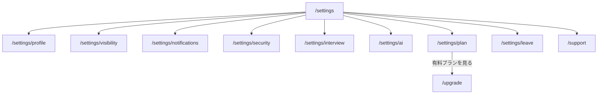

設定は [会員の枠](/pages/member-layout#設定) にあり、一覧（`/settings`）から各ページへ移る。プロフィールの編集は [プロフィール](/pages/member-profile) が、AI インタビューは [AI インタビュー](/pages/member-interview) が持つ。

## 一覧

パス: `/settings`。

プロフィール・公開範囲・通知・セキュリティ・AI インタビュー・AI と API・プランと解約・退会・お問い合わせを、ほかの項目と同じ見た目で並べる。「その他」や「詳細設定」の奥に置かない。

## 公開範囲

パス: `/settings/visibility`。既定は「全会員」で、一覧と検索には載せない側である。

1. 見出し「公開範囲」
2. 「プロフィールを見られる人」（全会員 / 自分だけ）
3. 「会員一覧と検索に載せる」
4. 「保存」

「自分だけ」にすると、リンクを知っている会員にもプロフィールと写真を見せない。判定の実体は [会員のつながり](/data-model/member-graph) が持つ。

## 通知

パス: `/settings/notifications`。

既定はすべてオフである。

1. 見出し「通知」
2. 「メッセージのメール通知」
3. 「掲示板のメール通知」
4. 「保存」

アプリ内の通知の有無は [通知](/pages/member-notifications) が持ち、ここではメールの可否だけを持つ。

## セキュリティ

パス: `/settings/security`。

1. 見出し「セキュリティ」
2. パスワードの変更
3. 認証アプリの設定・解除
4. パスキーの登録・削除
5. ログイン中のセッションの一覧と、個別の終了

バックアップコードで入った直後は、認証アプリの登録し直しを案内する。

## AI と API

パス: `/settings/ai`。既定は許可しない側である。

1. 見出し「AI と API」
2. 「AI に下書きの提案を許可する」
3. 「利用状況を改善のために共有する」
4. 「保存」

## プランと解約

パス: `/settings/plan`。実体は [契約](/data-model/billing) が持つ。

1. 見出し「プランと解約」
2. いまのプラン（無料 / 有料）と、有料なら現在期間の末
3. 無料のとき: 「有料プランを見る」（`/upgrade`）
4. 有料のとき: 「解約する」。確認のダイアログには、解約後は無料になることだけを書く

引き止めのページを挟まない。解約のボタンは、ほかの操作と同じ大きさと色の濃さにする。

## 退会

パス: `/settings/leave`。

1. 見出し「退会」
2. 退会後 30 日間は復旧できることの案内
3. 「退会する」。確認のダイアログには何が起きるかだけを書く

成功したらログアウトし、LP へ移る。

## 遷移

