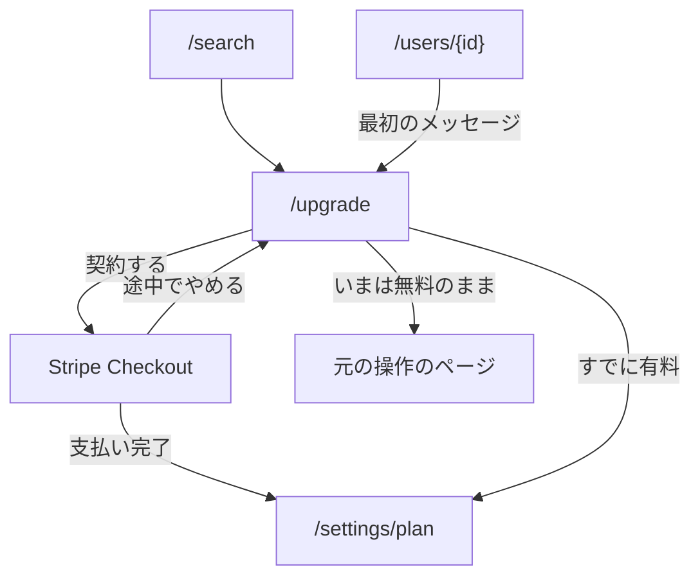

パス: `/upgrade`。[会員の枠](/pages/member-layout#会員の枠) に入る。探す・最初のメッセージなど、有料の操作から移ってくる。

実体は [契約](/data-model/billing) が持つ。すでに有料の利用者が開いたときは、[プランと解約](/pages/member-settings)（`/settings/plan`）へ移る。

## 構成

上から次の順に置く。

1. 見出し「有料プラン」
2. 有料でできることの一覧
   - 他の利用者を探す
   - まだやり取りの無い相手へメッセージを送る
3. 料金の表示（Stripe の Price から通貨と周期を 1 行で出す。取れないときは手続きの画面で確かめられる旨を出す）
4. 「契約する」ボタン
5. 「いまは無料のまま使う」（ひとつ前のページ、無ければホームへ戻る）

- 引き止めや、無料のままでは足りないことを長く並べるブロックは置かない
- 「契約する」の先は Stripe Checkout へ移る。支払いが済むと `/settings/plan?checkout=success` に戻り、途中でやめると `/upgrade?checkout=cancel` に戻ってその旨を出す。手続きを始められなかったときはこのページに理由を出す

## 状態ごとの表示

| 状態         | 表示                                   |
| ------------ | -------------------------------------- |
| 手続き中     | 「契約する」を押せない状態にする       |
| 失敗         | 理由を本体の下に出す                   |
| 途中でやめた | まだ契約していないことを本体の下に出す |
| すでに有料   | `/settings/plan` へ移る                |

## 遷移

