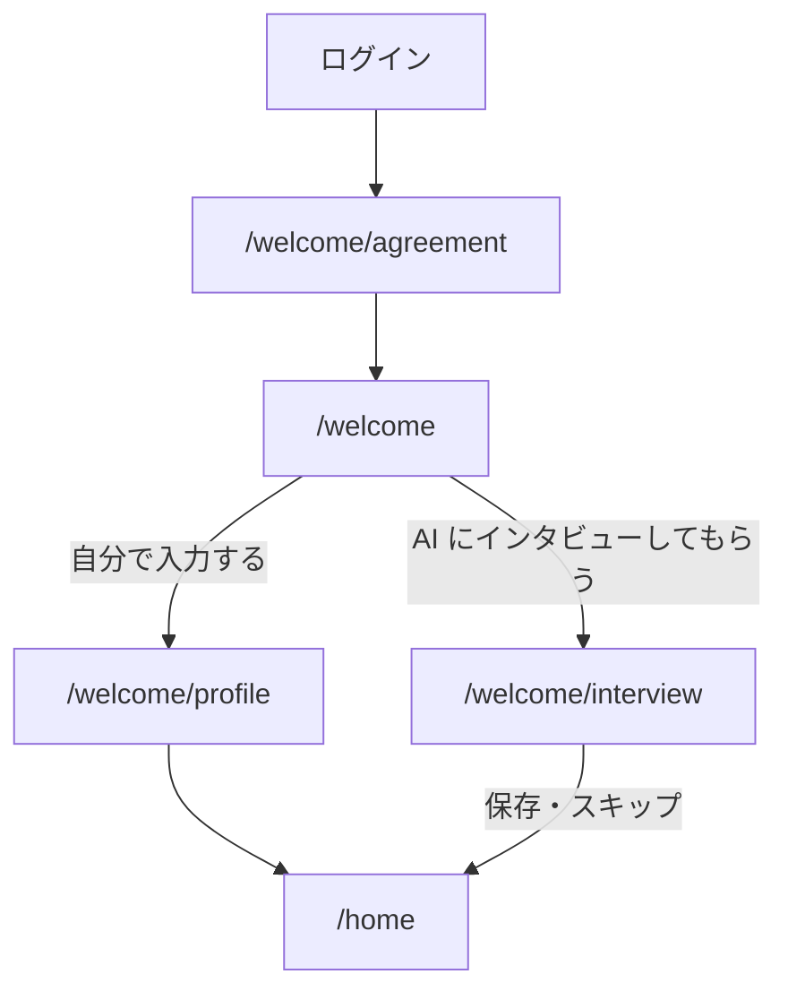

パスは次のとおりで、すべて [登録の枠](/pages/member-layout#登録の枠) に入る。

| ページ                     | パス                 |
| -------------------------- | -------------------- |
| 過去のデータの復旧         | `/welcome/recovery`  |
| 規約への同意               | `/welcome/agreement` |
| プロフィールの作り方を選ぶ | `/welcome`           |
| 基本項目の入力             | `/welcome/profile`   |

AI インタビューは [AI インタビュー](/pages/member-interview) が持つ。規約の再同意は [規約への同意](/pages/member-agreement) が持つ。

## 過去のデータの復旧

退会から 30 日以内に同じメールアドレスで再登録した利用者だけ、規約への同意の前に一度だけ通る。

1. 見出し「過去のデータの復旧」
2. 以前の表示名の案内
3. 「過去のデータを復旧する」
4. 「新しい会員として続ける」

どちらを選んでも `/welcome/agreement` へ進む。復旧できるデータがない利用者はこのページを出さない。

## 規約への同意（登録時）

上から次の順に置く。

1. 見出し「利用規約への同意」
2. 利用規約とプライバシーポリシーへのリンク
3. 「同意して続ける」ボタン

同意したら `/welcome` へ移る。同意しない限り先に進めない。

## プロフィールの作り方を選ぶ

上から次の順に置く。

1. 見出し「プロフィールの作り方」
2. 「自分で入力する」
3. 「AI にインタビューしてもらう」
4. 進み具合（登録の段階の何番目か）

- 「自分で入力する」は `/welcome/profile` へ移る
- 「AI にインタビューしてもらう」は `/welcome/interview` へ移る

## 基本項目の入力

上から次の順に置く。

1. 見出し「基本プロフィール」
2. ユーザー名の入力欄
3. 自己紹介の入力欄と残りの文字数
4. 「保存して始める」ボタン

成功したらホーム（`/home`）へ移る。途中でやめた利用者は、次のログインで終えていない段階から続ける。

## 遷移

