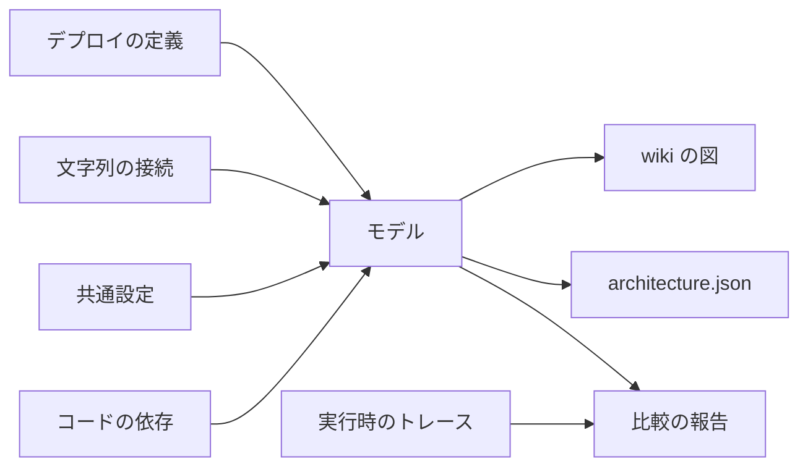

構成図を手で描くと、描いた時点から実体とずれ始めます。この計画では、デプロイに使う定義とコードそのものから図を生成し、古い図や抜けのある図が main に入らないように、機械のチェックで止めます。

状況は未着手です。この文書は、確定した決定と、まだ決まっていない論点を分けて持ちます。

## 目的

- 図が、実際にデプロイされる構成と食い違わない。
- 構成を変える変更では、図の差分がレビューの対象として現れる。
- 実体にある接続が図から漏れず、実体に無い接続が図に現れない。
- 実行基盤の提供元が増えても、同じ仕組みで図に載る。
- 主要な構成要素を、提供元の公式アイコンで見分けられる。

## 品質の定義と観測方法

| 性質 | 観測方法 |
| --- | --- |
| 最新である | 生成結果とコミット済みの図が一致するかを比べる。merge queue でも全件で実行する |
| 抜けが無い | 取り出し元の資源・接続・スタックがすべて図に出ているかを、取り出し元から導いた集合と比べる |
| 根拠の無い線が無い | 図の各辺が取り出し元に存在するかを比べる |
| 読める | 既存の図の描画テスト（線・箱・文字の重なり）を通し、1 枚あたりのノード数に上限を置く |
| 秘密が載らない | 生成物に、検証用の秘密の値やアカウント ID が現れないことをテストで確かめる |
| アイコンが見える | 両テーマの背景色に対するアイコンのコントラストを測る |
| 実際に表示される | agent-browser で wiki のページを開き、描画結果を確かめる |

## 採らない方法

- ソースコードの構文解析で資源を拾う方法は採りません。スタックは Effect のプログラムで、作られる資源が capability の付与や設定の値で変わり、env もスプレッドで合成しているため、構文からは実際の構成が決まりません。
- Alchemy の公式機能には、2.0.0-beta.79 の時点で依存グラフや構成図を出すものがありません。`plan` は差分の表示、`state` は保存した状態の閲覧です。開発中の Dashboard（alchemy-run/alchemy#1493、Draft）はデプロイの進み具合を扱うもので、構成図の代わりになりません。

## 図の元になる情報

図は、次の取り出し元を 1 つのモデルにまとめてから描きます。モデルの各辺は、どの取り出し元から来たかを持ちます。



| 取り出し元 | 取れるもの | 取り方 |
| --- | --- | --- |
| デプロイの定義 | 資源、binding、キューの consumer、cron、独自ドメイン、スタック間の参照 | 各スタックを、実アカウントに触れずに検証用の設定値で評価する。`infra/cloudflare` の `compileStack` が行っている評価を使う |
| 文字列の接続 | 監視 Worker から各アプリへの HTTP、OTLP の送信先、メールの送信先 | 検証用の設定値はそれぞれ一意の値なので、env の値がどの設定値と完全一致するかで接続先を決める |
| 共通設定 | アプリごとの capability、core のエントリポイント | `@repo/config` の宣言を読む |
| コードの依存 | パッケージ間と、各アプリの FSD の層の間の import | dependency-cruiser の型付き API を、lint と同じ設定モジュールで呼ぶ |
| 実行時のトレース | e2e で実際に起きたサービス間の呼び出し | ローカルの Tempo から取る |

実行時のトレースは実行ごとに揺れるため、コミットする図には使わず、宣言と実際の呼び出しの比較にだけ使います。

図に登場する人（利用者や運用担当）はコードから導けないため、図には載せません。公開ドメインを持つかどうかまでを描きます。

## 図の種類

| 図 | 答える問い | 取り出し元 |
| --- | --- | --- |
| 実行基盤の構成図 | 何がどこで動き、何につながっているか | デプロイの定義、文字列の接続、共通設定 |
| アプリ別の詳細図 | 1 つの Worker が何を binding として持つか | デプロイの定義、共通設定 |
| デプロイ順 | どのスタックがどのスタックを前提にするか | スタック間の参照 |
| コードの依存図 | パッケージと層がどう依存しているか | コードの依存 |
| 宣言と実際の呼び出しの比較 | 宣言したが一度も使われていない binding はどれか | デプロイの定義、実行時のトレース |

最後の 1 つは図ではなく報告として出し、最小権限の確認に使います。

## 配置

生成は、定義を持つ側ではなく、定義を読む側のツールが持ちます。`infra/` はインフラの定義の置き場なので、生成器は置きません。

```
tools/architecture/            生成とチェック（新設、private）
infra/cloudflare/              スタックの評価関数を ./inventory として公開するだけ
apps/internal-dashboard/
  content/docs/architecture/   生成物（コミットする）
  src/shared/diagram/          アイコンの差し込みとアイコンパック
```

- 依存の向きは `tools/architecture` → `infra/cloudflare` → 各アプリのビルドの一方向です。wiki は生成物を読むだけで、`tools/architecture` に依存しません。
- 新しいワークスペースを作るのは、既存のどれも所有者に当たらないためです。この理由は作成時のコミットログに書きます。
- 新しいワークスペースには `AGENTS.md` と、そのシンボリックリンクの `CLAUDE.md` が要ります。`AGENTS.md` はユーザー本人の指示でしか編集しないため、作成時に内容を示して指示を受けます。
- ER 図の生成も `tools/architecture` に移し、wiki に載せる生成図の作り方を 1 つにします。

## 提供元が増えたときの扱い

Alchemy の資源の種別は `Provider.Service.Resource` の形で、binding とスタック間の参照は提供元に依存しない共通の仕組みです。これに合わせて 3 層に分けます。

- 評価元の登録。infra の各パッケージが、自分のスタックを評価する関数を公開する。戻り値は Alchemy の評価結果そのままで、新しい共通の型は作らない。
- 提供元ごとの対応表。資源の種別から、図の上での種類（compute、SQL データベース、KV、オブジェクトストレージ、キューなど）とアイコンを引く。提供元が増えたら表を 1 つ足す。
- 共通の変換。辺の取り出し、参照の解決、文字列の接続の解決を、提供元に依存せず 1 つの実装で持つ。

## アイコン

主要な構成要素には、提供元の公式アイコンをその配色のまま使います。`DESIGN.md` はこのリポジトリが提供するサービスの見た目を決めるもので、他社のロゴには当てはまりません。

| アイコンパック | 出どころ | 取り込み方 |
| --- | --- | --- |
| `cloudflare:` | cloudflare/cloudflare-docs の製品アイコン（CC BY 4.0） | SVG を同梱し、取得元のコミット・ライセンス・ハッシュを manifest に記録する |
| `logos:` | Iconify の logos（CC0）にある主要なサービスのブランドロゴ | npm の `@iconify-json/logos` |
| `lucide:` | どのパックにも無い種類の汎用アイコン | UI と同じ lucide |

- Mermaid には標準の `id@{ icon: "cloudflare:d1", label: "DB" }` と `class` 文で書き、独自の記法は作りません。
- 描画に使う beautiful-mermaid はフローチャートのアイコンに対応していません。描画前にアイコンの指定を取り出してラベルに置き場所を空け、描画後に SVG の `data-id` を目印に差し込みます。
- AWS のロゴは logos に一部しかありません。AWS を足すときに、公式の Architecture Icons を使うかを決めます。

## 強制の仕組み

図を生成するだけでは、手書きの図や古い図に戻る余地が残ります。守る性質ごとに、止める仕組みを置きます。

| 守る性質 | 止める仕組み |
| --- | --- |
| 図が最新である | `verify:architecture` が、生成結果と `architecture/` の中身の完全一致を確かめる。余計なファイルがあっても落ちる |
| 図が最新である | `prepr` に加えて `premerge` にも入れ、merge queue で全件を実行する |
| 図が最新である | `tools/architecture` がスタックを持つ全パッケージを依存として宣言し、PR CI の影響範囲に入る。宣言の抜けは、スタックのエントリポイントから導いた集合と比べるテストで落ちる |
| 図が最新である | 生成物の front-matter に本文のダイジェストを持たせ、wiki のテストで一致を確かめる。手で直すとその PR で落ちる |
| 図から漏れない | 全ての `alchemy.run.ts` が、登録済みの評価元のスタックに含まれることをテストする |
| 図から漏れない | 対応表に無い提供元や資源の種別が現れたら落ちる。既定の描き方に逃がさない |
| 図から漏れない | Effect Schema で URL かメールアドレスとして解釈できる env の値が、接続先に解決できなければ落ちる |
| 図から漏れない | 接続先の直書きは、既存の `no-hardcoded-endpoint--read-from-configuration` が止める |
| 図から漏れない | 評価元どうしの検証用の値が重なったら落ちる |
| 根拠の無い線が無い | 図の各辺と取り出し元を両方向から比べる |
| 手書きの構成図に戻らない | 生成時に `architecture.json` を書き出し、`architecture/` の外の Mermaid 図がその識別子を描いていたら wiki のテストで落ちる。識別子は binding 名や資源の種別のように判定のぶれないものに絞る。既存の文書で検出されたものは、生成図へ移してから入れる |
| 生成器を定義の側に置かない | `@repo/infra-cloudflare/inventory` を import できるのは `tools/architecture` だけにする（dependency-cruiser） |
| 生成器を定義の側に置かない | `content/docs` を指すパスの文字列を書けるのは `tools/architecture` と wiki だけにする（構文木で判定する oxlint のルール） |
| 生成器を定義の側に置かない | 実行コードから tools を import させないことは、既存の `no-runtime-to-tools` が止める |
| アイコンが決まっている | 資源の種別からアイコンへの表を網羅させ、未登録の種別やパックで落ちる。既存の `render-diagram.test.ts` が全文書を描画するので、手書きの図も同じテストを通る |
| 同梱したアイコンが取得元と一致する | 同梱した全ファイルが manifest にあり、ハッシュが一致することをオフラインのテストで確かめる |
| ライセンスの表記が抜けない | CC BY のパックを使った図には描画処理がクレジットを付け、その有無をテストする |
| アイコンが両テーマで見える | 背景色とのコントラストが 3:1 以上あることをテストし、足りないものはパックの設定で下地を敷く |
| アイコンの取り込み方が 1 通り | `@iconify-json/logos` と同梱の SVG を import できるのは図の描画処理だけにする |
| 旧実装が残らない | ER 図の旧生成器と同期テストと `db:schema-document` を消し、`knip --strict` で残りを検出する |

### 機械で止められない部分

- 本文の文章に資源を並べることは、ぶれなく判定できません。[このテンプレートは何か](/getting-started/what-is-this)のインフラの行は KV、R2、Workers AI、メール、Flagship が抜けており、生成図へのリンクに置き換えますが、今後の文章は止められません。
- Alchemy の外で作った資源は評価結果に現れません。今の `check-account` は宣言に無い資源を見つけないため、実アカウントを見るチェックとして別に扱います。

## 段取り

stacked PR で進めます。

| 順 | 内容 |
| --- | --- |
| 0 | wiki でサブグラフが描けるかを確かめ、アイコンパックの仕組み（Cloudflare の公式アイコンの同梱、manifest、クレジット、コントラストのテスト、差し込み）を入れる |
| 1 | `tools/architecture` を作り、ER 図の生成を移す。旧実装の削除、ダイジェストの一致の確認、パスの所有ルール、`inventory` の import の制限、`premerge` への組み込み、依存宣言の抜けのテストを、この小さな生成器で先に動かす |
| 2 | 評価元の登録、提供元に依存しないモデル、Cloudflare の対応表、文字列の接続の解決、`alchemy.run.ts` の登録テストを入れる |
| 3 | 実行基盤の構成図・アプリ別の詳細図・デプロイ順を wiki に載せ、`architecture.json` と手書きの図の検出を入れ、インフラの行を置き換える |
| 4 | コードの依存図を入れる |
| 5 | 宣言と実際の呼び出しの比較を入れる |

## まだ決まっていない論点

- wiki の図の後処理が、サブグラフの枠を重なりとして扱わないか。段取り 0 で確かめ、扱う場合はグループの枠を認識させるか、サブグラフを使わない描き方に変える。
- Alchemy が資源の種別名をリテラル型で公開しているか。公開していれば対応表の網羅を型で確かめ、していなければ実行時のチェックだけにする。
- ローカルの otel-lgtm で Tempo の service graph が有効か。無効なら span の親子関係から集計する。
- 宣言と実際の呼び出しの比較をどのワークスペースが持つか。e2e の実行、トレースの取得、スタックの評価にまたがるため、段取り 5 の着手時に決める。
- 図の書き出しを、手動のコマンドではなくどのライフサイクルに載せるか。ER 図はマイグレーションの生成に連動しているが、スタックの定義の変更に連動するタスクはまだ無い。
- 既存の `verify:stacks` は `prepr` にしか入っておらず、アプリの `alchemy.run.ts` だけを変えた PR では実行されない可能性がある。この計画とは別の PR で確かめて塞ぐ。
