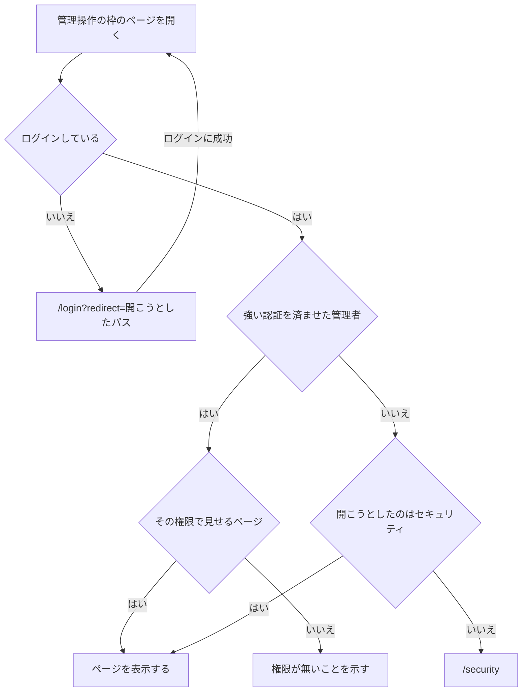
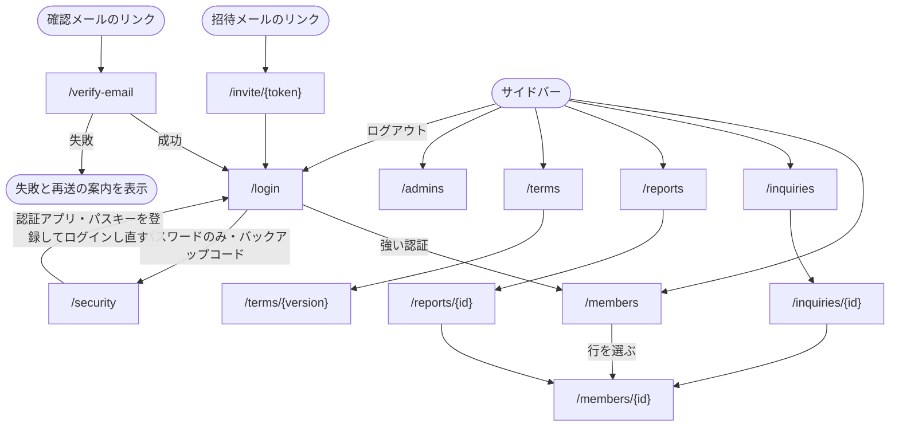

この文書は、目指す画面の構成を書いている。いまの管理操作の枠は、上端のヘッダーと左のサイドナビに 2 ページだけを並べる形で、この文書の形になるのは [#339](https://github.com/masseater/typescript-template/issues/339) からである。各ページがいまあるかどうかは、表の「状態」の列が示す。

管理者アプリのページは、認証を済ませる前に使う枠と、管理操作に使う枠のどちらか 1 つに入る。管理操作に使う枠は、強い認証を済ませた管理者にしか表示しない。

## 認証前の枠

ログイン・メールアドレスの確認・招待を受けるときに使う。ナビゲーションを持たず、1 つの作業だけを画面中央に置く。

- 上: アプリ名「管理画面」
- 中央のカード
  - ページの見出し
  - ページの本体

| ページ               | パス              | 状態                                                                |
| -------------------- | ----------------- | ------------------------------------------------------------------- |
| ログイン             | `/login`          | いまある                                                            |
| メールアドレスの確認 | `/verify-email`   | いまある                                                            |
| 招待を受ける         | `/invite/{token}` | [#298](https://github.com/masseater/typescript-template/issues/298) |

## 管理操作の枠

左にサイドバー、右に本体の枠を置く。本体の枠は、サイドバーから少し離した角丸の枠にする。

- サイドバー
  - 上端に、アプリ名「管理画面」とサービス名を置く
  - 項目をグループの見出しの下に並べ、いま表示しているページの項目を選択状態にする
  - 対応待ちがある項目には、件数のバッジを付ける
  - 権限の無い項目は出さない
  - 下端に、ログイン中の管理者の名前とメールアドレスを置き、開くとセキュリティとログアウトを選べる
  - 画面幅が広いときは、アイコンだけに畳める。狭いときは閉じておき、ヘッダーのメニューボタンで開く
- 本体の枠のヘッダー
  - サイドバーを畳む・開くボタン、パンくず、検索を置く
- 本体
  - 先頭にページの見出しを置く
  - 権限の無い操作のボタンは出さない
  - 操作の結果は本体の上に重ねる通知で知らせ、見出しや表の位置を動かさない

| ページ       | パス                            | サイドバー       | 閲覧のみ | 操作できる | 管理者を追加できる | 状態                                                                                                           |
| ------------ | ------------------------------- | ---------------- | -------- | ---------- | ------------------ | -------------------------------------------------------------------------------------------------------------- |
| 利用者の一覧 | `/members`                      | 運用・利用者     | 見る     | 見る・操作 | 見る・操作         | いまは `/`（ユーザー一覧）。[#339](https://github.com/masseater/typescript-template/issues/339) で移す         |
| 利用者の詳細 | `/members/{id}`                 | 出さない         | 見る     | 見る・操作 | 見る・操作         | [#339](https://github.com/masseater/typescript-template/issues/339)                                            |
| 問い合わせ   | `/inquiries`・`/inquiries/{id}` | 運用・問い合わせ | 見る     | 見る・返信 | 見る・返信         | [#311](https://github.com/masseater/typescript-template/issues/311)                                            |
| 通報         | `/reports`・`/reports/{id}`     | 運用・通報       | 見る     | 見る・処置 | 見る・処置         | [#307](https://github.com/masseater/typescript-template/issues/307)                                            |
| 規約         | `/terms`・`/terms/{version}`    | 設定・規約       | 見る     | 見る・公開 | 見る・公開         | [#299](https://github.com/masseater/typescript-template/issues/299)                                            |
| 管理者       | `/admins`                       | 設定・管理者     | 出さない | 出さない   | 見る・操作         | [#298](https://github.com/masseater/typescript-template/issues/298)                                            |
| セキュリティ | `/security`                     | 下端のメニュー   | 見る     | 見る       | 見る               | いまある。いまの名前は認証設定で、[#339](https://github.com/masseater/typescript-template/issues/339) で改める |

- 利用者の詳細は、利用者の一覧の行を選ぶと開く。一覧の行からの操作も残す
- 利用者の詳細には、状態・契約・問い合わせ・通報・処置の履歴をまとめる
- 問い合わせと通報からは、その利用者の詳細へ移れる
- 権限の無いページの URL を直接開いたときは、権限が無いことを示す

## 枠へ入る条件

セキュリティだけは、強い認証を済ませるための手段を登録するページなので、ログインしていれば追加認証の前でも表示する。

- 強い認証は、パスキーでのログインと、パスワードに認証アプリの確認コードを重ねたログインを指す。バックアップコードでのログインは含まない
- `redirect` に置けるのは管理者アプリ内のパスだけで、それ以外の値は利用者の一覧として扱う
- ログアウトしたら `/login` へ移る

## 遷移図

`redirect` を持ってログインしたときは、利用者の一覧ではなく `redirect` のページへ移る。いまあるページの中身は [ログイン](/pages/admin-login) と [ユーザー一覧](/pages/admin-users) が持つ。
