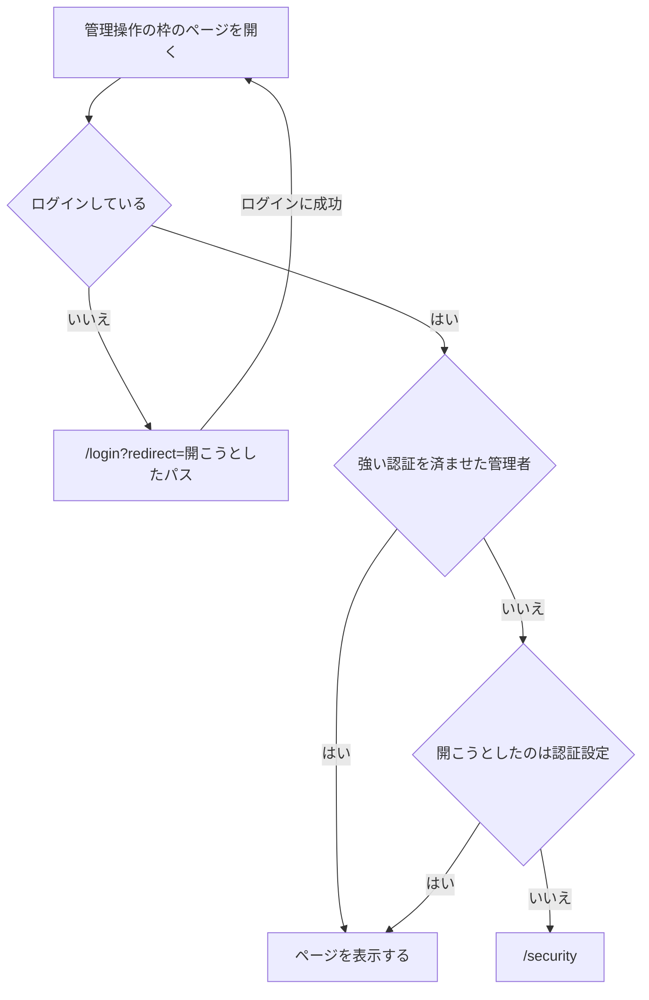
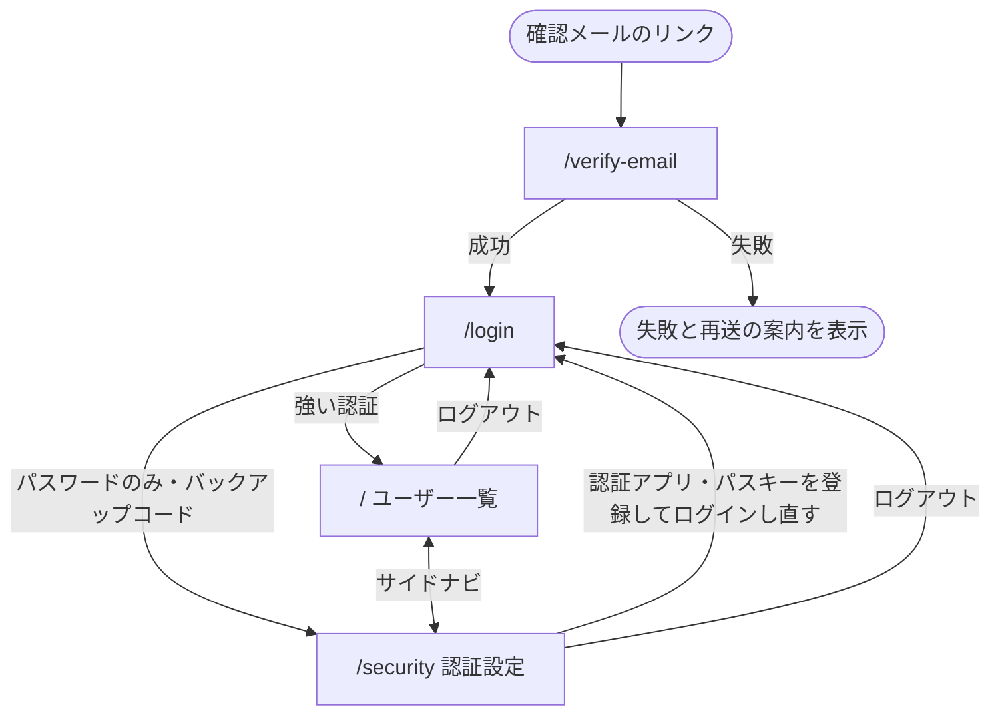

管理者アプリのページは、認証を済ませる前に使う枠と、管理操作に使う枠のどちらか 1 つに入る。管理操作に使う枠は、強い認証を済ませた管理者にしか表示しない。

## 認証前の枠

ログインとメールアドレスの確認に使う。ナビゲーションを持たず、1 つの作業だけを画面中央に置く。

- 上: アプリ名「管理画面」
- 中央のカード
  - ページの見出し
  - ページの本体

| ページ               | パス            |
| -------------------- | --------------- |
| ログイン             | `/login`        |
| メールアドレスの確認 | `/verify-email` |

## 管理操作の枠

画面の上端にヘッダー、その下の左にサイドナビ、右に本体を置く。

- ヘッダー
  - 左にアプリ名を置き、ユーザー一覧へのリンクにする
  - 右にログイン中の管理者のメールアドレスを置き、開くとログアウトを選べる
- サイドナビ
  - いま表示しているページの項目を選択状態にする
  - 画面幅が狭いときは閉じておき、ヘッダーのメニューボタンで開く
- 本体
  - 先頭にページの見出しを置く
  - 操作の結果は本体の上に重ねる通知で知らせ、見出しや表の位置を動かさない

| ページ       | パス        | サイドナビの項目 |
| ------------ | ----------- | ---------------- |
| ユーザー一覧 | `/`         | ユーザー一覧     |
| 認証設定     | `/security` | 認証設定         |

## 枠へ入る条件

認証設定だけは、強い認証を済ませるための手段を登録するページなので、ログインしていれば追加認証の前でも表示する。

- 強い認証は、パスキーでのログインと、パスワードに認証アプリの確認コードを重ねたログインを指す。バックアップコードでのログインは含まない
- `redirect` に置けるのは管理者アプリ内のパスだけで、それ以外の値はユーザー一覧として扱う
- ログアウトしたら `/login` へ移る

## 遷移図

`redirect` を持ってログインしたときは、ユーザー一覧ではなく `redirect` のページへ移る。各ページの中身は [ログイン](/pages/admin-login) と [ユーザー一覧](/pages/admin-users) が持つ。
