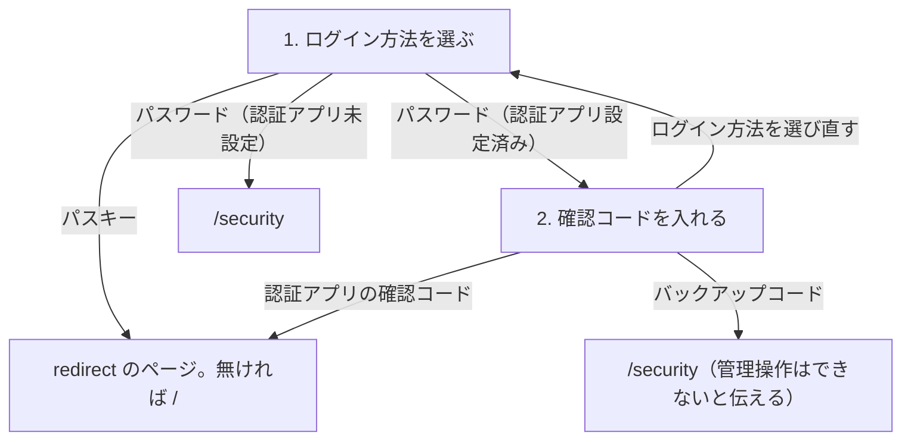

パス: `/login`。[認証前の枠](/pages/admin-layout#認証前の枠) に入る。

管理者アプリには新規登録の入口を置かない。管理者になれるのは、利用者アプリで登録してメールアドレスを確認済みのユーザーだけである。

## 構成

段階ごとに本体を入れ替え、同じページの中で進む。

### 1. ログイン方法を選ぶ

上から次の順に置く。

1. 見出し「管理者ログイン」
2. メールアドレスの入力欄
3. パスワードの入力欄
4. 「ログイン」ボタン
5. 「または」の区切り
6. 「パスキーでログイン」ボタン

### 2. 確認コードを入れる

パスワードでのログインに認証アプリが設定されているときだけ出る。

上から次の順に置く。

1. 見出し「管理者ログイン」
2. 認証アプリの確認コードの入力欄
3. 「確認コードでログイン」ボタン
4. 「バックアップコードを使う」
5. 「ログイン方法を選び直す」

- 「バックアップコードを使う」で入力欄をバックアップコード用に替え、「認証アプリのコードを使う」で戻す
- 「ログイン方法を選び直す」で 1 に戻り、入力済みの値を消す

## 状態ごとの表示

- 処理中: 送信ボタンを押せない状態にし、処理中であることを本体の下に出す
- 失敗: 入力欄を残したまま、理由を本体の下に出す
  - メールアドレスかパスワードが違う
  - 確認コードが違う
  - メールアドレスが未確認、または管理者ではない

## 遷移

