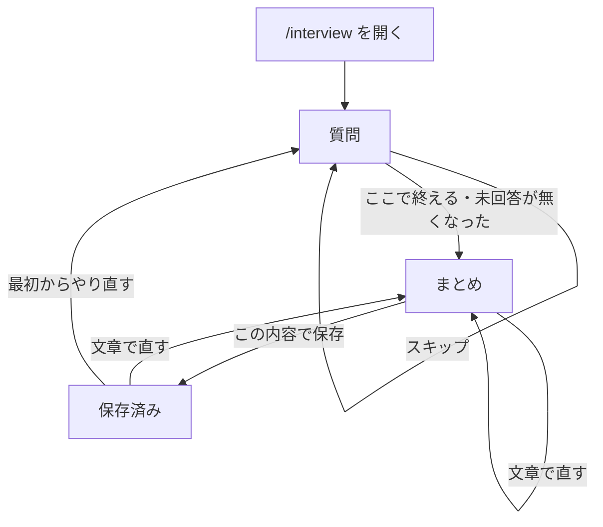

パス: `/interview`。[会員の枠](/pages/user-layout#会員の枠) に入る。

AI が質問を重ね、利用者の発話から自己紹介シートの項目を埋める。利用者は、AI が出した回答欄を使っても、回答欄を使わずに文章で答えてもよい。どちらも同じ 1 つの発話として扱う。

## 自己紹介シート

インタビューが埋める対象で、どの項目も空のまま保存できる。

| 項目       | 値                       |
| ---------- | ------------------------ |
| 呼び名     | 30 文字までの文字列      |
| 職種       | 50 文字までの文字列      |
| 興味       | 20 文字までの文字列 5 個 |
| 活動エリア | 50 文字までの文字列      |
| ひとこと   | 200 文字までの文字列     |

各項目は、未回答・回答済み・スキップのどれか 1 つの状態を持つ。

## 構成

メッセージアプリのトーク画面の形にする。

- 上端: インタビュアーの名前、進み具合（例: 3 / 5 項目）、「ここで終える」
- 中央: 会話。AI の発話を左、利用者の発話を右の吹き出しにし、新しい発話が下に足される
- 会話の下: いまの質問への回答欄と「この質問はスキップ」
- 下端: 文章の入力欄と送信ボタン
- 会話の横: 整形中の自己紹介シート。項目ごとに値か、未回答・スキップの状態を出す
  - 画面幅が狭いときは閉じておき、上端の進み具合を押すと開く

回答欄は次のどれか 1 つで、AI が質問ごとに選ぶ。回答欄を出さない質問もある。

| 回答欄      | 操作                                   |
| ----------- | -------------------------------------- |
| 単一選択    | 選択肢を押すと、その選択肢を発話する   |
| 複数選択    | 選択肢を選んでから「これで送る」を押す |
| はい/いいえ | 押した側を発話する                     |

- 回答欄が出ているあいだも、文章の入力欄は使える
- 回答欄で答えたときも、選んだ内容を利用者の吹き出しとして会話に足す
- 利用者が発話したら、AI の次の発話が届くまで、会話の末尾に入力中の表示を出す

## 会話の決まり

- 1 つの発話から埋められる項目は、いまの質問の対象でなくてもすべて埋める
- 回答済みの項目の言い直しは、新しい値で上書きする
- 回答済みの項目とスキップの項目は、利用者が自分から触れないかぎり質問しない
- 「この質問はスキップ」と、文章でのスキップの求めは、いまの質問の項目をスキップにして次の質問へ進む
- 「ここで終える」と、文章での終了の求めは、未回答の項目が残っていてもその場で質問を終えて、まとめへ進む
- 未回答の項目が無くなったら、まとめへ進む
- AI が出した回答欄や値が決まった形に合わないときは、回答欄なしの質問に替える。利用者には失敗として見せない
- 複数選択の回答欄は興味の質問にだけ出し、選べるのは 5 個までとする
- AI に読み取らせる発話は、利用者ごとに 1 日 60 回までとする。「この質問はスキップ」と「ここで終える」は回数に数えない
- 会話として保つのは直近の 100 発話までとする

## まとめ

質問を終えると、AI が整形した自己紹介シートを会話の中のカードとして出す。

- カードには全項目を出し、値の無い項目は空欄であることを示す
- カードの下に「この内容で保存」を置く
- 保存の前後を問わず、文章で伝えればシートを直せる。直すたびに新しいカードを出す
- 保存に成功したら、保存したことを AI の発話として会話に足す

## 状態ごとの表示

| 状態 | 表示 |
| --- | --- |
| 初めて開いた | AI の最初の質問から始める |
| 途中のインタビューがある | それまでの会話とシートを戻し、最後の質問から続ける |
| 保存済みのシートがある | 最後のカードまでの会話を戻し、「最初からやり直す」を回答欄の位置に置く |
| 会話を読み込み中 | 構成の枠を保ったまま、会話の位置に読み込み中の表示を出す |
| AI の発話を受け取れなかった | 利用者の発話を残したまま、受け取れなかったことと再試行を会話の末尾に出す |
| 1 日に使える回数を使い切った | 今日はこれ以上話せないことを会話の末尾に出し、それまでのシートは保つ |
| 保存できなかった | カードを残したまま、保存できなかったことを会話の末尾に出す |
| 保ってある会話を読めなかった | 保存済みのシートは保ったまま、AI の最初の質問から始める |

「最初からやり直す」は、取り消せないことを確認してから、会話とシートを消して最初の質問に戻る。

## 遷移

