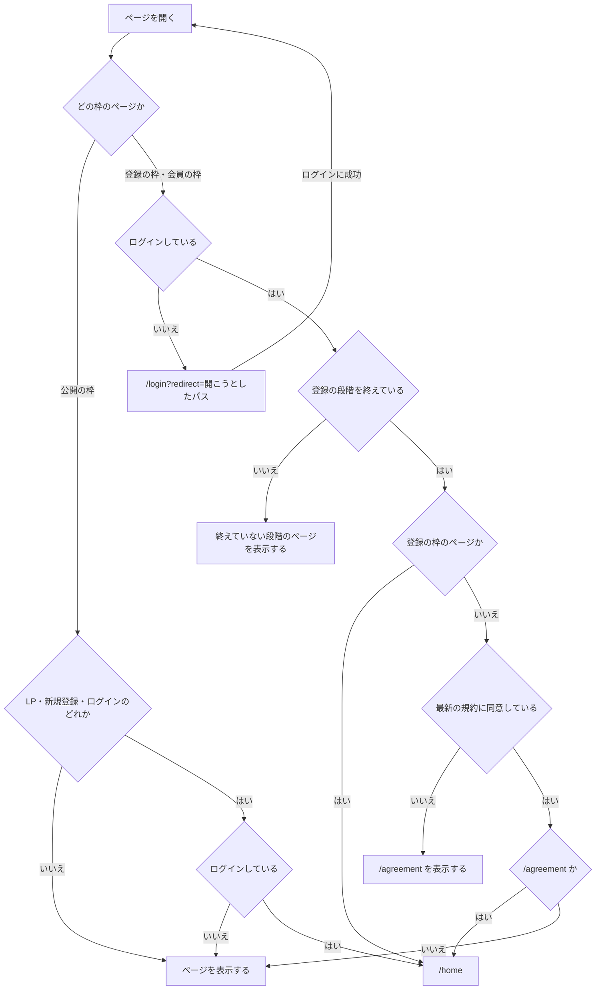
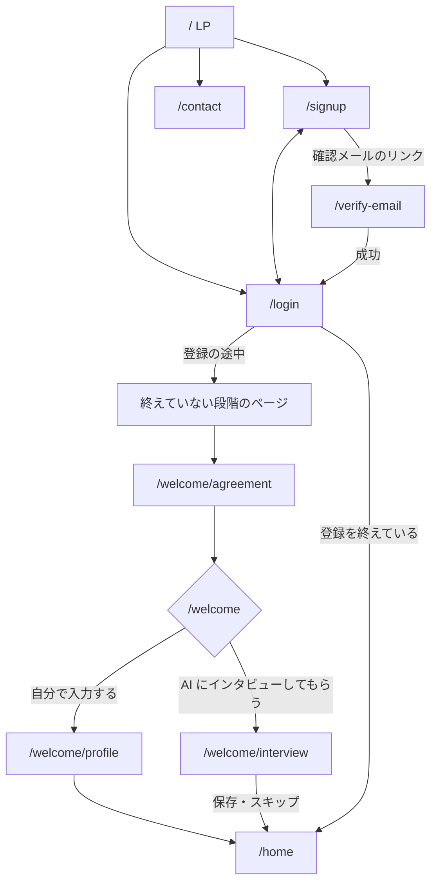
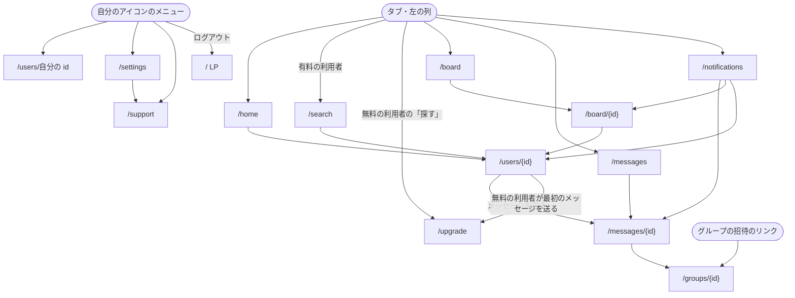

利用者アプリのページは、誰でも開ける公開の枠、登録の直後に通る登録の枠、ログインした利用者だけが使う会員の枠のどれか 1 つに入る。

## 公開の枠

サービスの紹介と、会員になるまでの手続きに使う。

- ヘッダー
  - 左にサービス名を置き、LP へのリンクにする
  - 右に「ログイン」と「新規登録」を置く。いま表示しているページ自身へのリンクは出さない
  - ログインしているときは、右に「ホーム」だけを置く
- 本体
  - LP は画面幅いっぱいを使う
  - それ以外は 1 つの作業だけを中央のカードに置く
- フッター
  - 利用規約・プライバシーポリシー・お問い合わせへのリンクを置く

| ページ                           | パス            |
| -------------------------------- | --------------- |
| LP                               | `/`             |
| 新規登録                         | `/signup`       |
| ログイン                         | `/login`        |
| メールアドレスの確認             | `/verify-email` |
| お問い合わせ（会員でない人向け） | `/contact`      |
| 利用規約                         | `/terms`        |
| プライバシーポリシー             | `/privacy`      |

- ログインしている利用者が `/contact` を開いたときは、会員向けのお問い合わせ（`/support`）へ移る

## 登録の枠

メールアドレスを確認した後の、初めてのログインで通る。ナビゲーションを持たず、1 つの作業だけを中央に置き、どこまで進んだかを上に示す。

| ページ                     | パス                 |
| -------------------------- | -------------------- |
| 規約への同意               | `/welcome/agreement` |
| プロフィールの作り方を選ぶ | `/welcome`           |
| 基本項目の入力             | `/welcome/profile`   |
| AI インタビュー            | `/welcome/interview` |

- プロフィールの作り方は、「自分で入力する」か「AI にインタビューしてもらう」かを選ぶ
- AI インタビューはいつでもスキップでき、スキップしたら空のプロフィールのままホームへ進む
- 登録の途中でやめた利用者は、次にログインしたとき、終えていない段階から続ける

## 会員の枠

ナビゲーションを 1 か所だけに置き、中身は中央の 1 列に出す。

- 画面幅が狭いとき
  - 下端にタブを置く
  - 上端の左に自分のアイコン、中央にページの見出しを置く
- 画面幅が広いとき
  - 左に細い列を置き、上にサービス名、下に自分のアイコンを置く
  - 本体は中央の 1 列に置く
- タブと左の列には、ホーム・探す・掲示板・メッセージ・通知を並べ、いま表示しているページの項目を選択状態にする
- 「探す」は有料の項目で、無料の利用者にも見せて「有料」の印を付け、無料の利用者が押したら有料の案内へ移る
- ほかの利用者に最初のメッセージを送るのは有料で、無料の利用者が送ろうとしたら有料の案内へ移る。届いたメッセージへの返信は無料でできる
- メッセージと通知の項目には、未読の件数を出す
- 自分のアイコンを押すと、自分のプロフィール・設定・お問い合わせ・ログアウトのメニューが開く
- 操作の結果は本体の上に重ねる通知で知らせ、見出しや一覧の位置を動かさない

| ページ                                 | パス                        | 入り方                                                             |
| -------------------------------------- | --------------------------- | ------------------------------------------------------------------ |
| ホーム（フォローしている利用者の動き） | `/home`                     | タブ                                                               |
| 探す                                   | `/search`                   | タブ                                                               |
| 有料の案内と契約                       | `/upgrade`                  | 有料の項目・最初のメッセージ                                       |
| 掲示板                                 | `/board`                    | タブ                                                               |
| スレッド                               | `/board/{id}`               | 掲示板・通知                                                       |
| メッセージ（1 対 1 とグループ）        | `/messages`                 | タブ                                                               |
| 会話                                   | `/messages/{id}`            | メッセージ・プロフィール・通知                                     |
| グループの情報と参加                   | `/groups/{id}`              | 会話・グループの招待のリンク                                       |
| 通知                                   | `/notifications`            | タブ                                                               |
| プロフィール                           | `/users/{id}`               | ホーム・探す・スレッド・通知・アイコンのメニュー・共有されたリンク |
| お問い合わせ                           | `/support`・`/support/{id}` | アイコンのメニュー・設定                                           |
| 規約の再同意                           | `/agreement`                | 規約の改定の後、ほかのページより先                                 |

## 設定

設定は会員の枠の中にあり、自分のアイコンのメニューの「設定」から開く。一覧（`/settings`）には、プロフィール・通知・セキュリティ・AI インタビュー・AI と API・プランと解約・退会・お問い合わせを並べ、それぞれ `/settings/profile`・`/settings/notifications`・`/settings/security`・`/settings/interview`・`/settings/ai`・`/settings/plan`・`/settings/leave`・`/support` へ移る。

- 「プランと解約」と「退会」は、一覧にほかの項目と同じ見た目で並べ、「その他」や「詳細設定」の奥に置かない
- 解約は、契約したときと同じ手数で終える。引き止めのページを挟まない
- 確認のダイアログには何が起きるかだけを書く
- 解約・退会のボタンは、ほかの操作のボタンと同じ大きさと色の濃さにする
- 公開範囲と検索への掲載は、プロフィールの設定に置く
- 通知・AI に許す操作・検索への掲載は、既定を「オフ」「許可しない」にする

## 枠へ入る条件

- `redirect` に置けるのは利用者アプリ内のパスだけで、それ以外の値はホームとして扱う
- ログアウトしたら LP へ移る

## 遷移図

入口から登録まで。

ログインした後。

`redirect` を持ってログインしたときは、ホームではなく `redirect` のページへ移る。各ページの中身は [LP](/pages/user-lp)、[新規登録](/pages/user-signup)、[ログイン](/pages/user-login)、[プロフィール](/pages/user-profile)、[探す](/pages/user-users)、[AI インタビュー](/pages/user-interview) が持つ。
