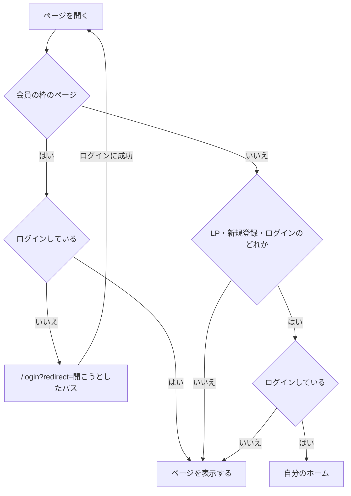
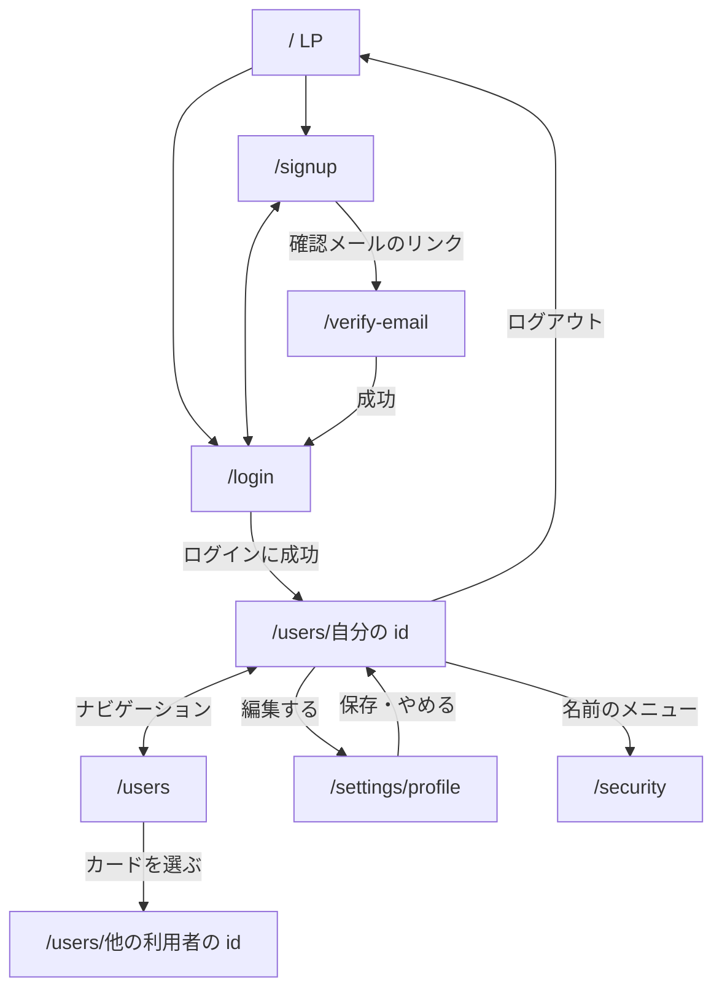

利用者アプリのページは、誰でも開ける公開の枠と、ログインした利用者だけが使う会員の枠のどちらか 1 つに入る。

## 公開の枠

サービスの紹介と、会員になるまでの手続きに使う。

- ヘッダー
  - 左にサービス名を置き、LP へのリンクにする
  - 右に「ログイン」と「新規登録」を置く。いま表示しているページ自身へのリンクは出さない
- 本体
  - LP は画面幅いっぱいを使う
  - それ以外は 1 つの作業だけを中央のカードに置く

| ページ               | パス            |
| -------------------- | --------------- |
| LP                   | `/`             |
| 新規登録             | `/signup`       |
| ログイン             | `/login`        |
| メールアドレスの確認 | `/verify-email` |

## 会員の枠

画面の上端にヘッダー、その下に本体を置く。

- ヘッダー
  - 左にサービス名を置き、自分のホームへのリンクにする
  - 中央にナビゲーションを置き、いま表示しているページの項目を選択状態にする
  - 右にログイン中の利用者の名前を置き、開くとプロフィールの編集・認証設定・ログアウトを選べる
  - 画面幅が狭いときはナビゲーションを閉じておき、メニューボタンで開く
- 本体
  - 先頭にページの見出しを置く
  - 操作の結果は本体の上に重ねる通知で知らせ、見出しや一覧の位置を動かさない

| ページ             | パス                | ナビゲーションの項目 |
| ------------------ | ------------------- | -------------------- |
| プロフィール       | `/users/{id}`       | ホーム（自分の id）  |
| ユーザー一覧       | `/users`            | ユーザーを探す       |
| プロフィールの編集 | `/settings/profile` | なし                 |
| 認証設定           | `/security`         | なし                 |

自分のホームは、自分の id を持つプロフィールのページである。

## 枠へ入る条件

- `redirect` に置けるのは利用者アプリ内のパスだけで、それ以外の値は自分のホームとして扱う
- ログアウトしたら LP へ移る

## 遷移図

`redirect` を持ってログインしたときは、自分のホームではなく `redirect` のページへ移る。各ページの中身は [LP](/pages/user-lp)、[新規登録](/pages/user-signup)、[ログイン](/pages/user-login)、[プロフィール](/pages/user-profile)、[ユーザー一覧](/pages/user-users) が持つ。
