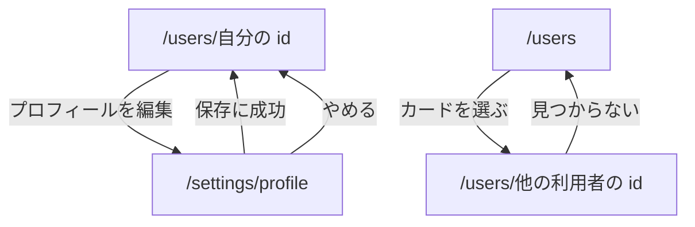

## プロフィール

パス: `/users/{id}`。[会員の枠](/pages/user-layout#会員の枠) に入る。自分の id で開いたものが自分のホームになる。

プロフィールを直せるのは本人だけである。他の利用者のプロフィールには、編集への入口を出さない。

### 構成

上から次の順に置く。

1. アバター（名前の頭文字）とユーザー名
2. 自己紹介
3. 登録した年月
4. 「プロフィールを編集」ボタン（自分のプロフィールだけ）

- 自己紹介が空のとき、自分のプロフィールには編集を促す案内を、他の利用者のプロフィールには「自己紹介はまだありません」を出す
- メールアドレスは、自分のものを含めてこのページに出さない

### 誰のプロフィールを開けるか

開けるのは、自分と、メールアドレスを確認済みの利用者のプロフィールである。

### 状態ごとの表示

| 状態                          | 表示                                                       |
| ----------------------------- | ---------------------------------------------------------- |
| 読み込み中                    | 構成の枠を保ったまま、各項目の位置に読み込み中の表示を出す |
| 開けない利用者・存在しない id | 利用者が見つからないことと、ユーザー一覧へのリンクを出す   |
| 取得できなかった              | 取得できなかったことと再試行ボタンを出す                   |

開けない利用者と存在しない id は、表示から区別できないようにする。

## プロフィールの編集

パス: `/settings/profile`。[会員の枠](/pages/user-layout#会員の枠) に入る。直す対象は常にログイン中の本人で、パスに id を持たない。

### 構成

上から次の順に置く。

1. 見出し「プロフィールの編集」
2. メールアドレス（変更できない値として示す）
3. ユーザー名の入力欄
4. 自己紹介の入力欄と、残りの文字数
5. 「保存」ボタンと「やめる」

### 状態ごとの表示

- 処理中: 「保存」を押せない状態にする
- 成功: 自分のホームへ移り、保存したことを通知する
- 失敗: 入力欄を残したまま、理由を本体の下に出す

## 遷移

