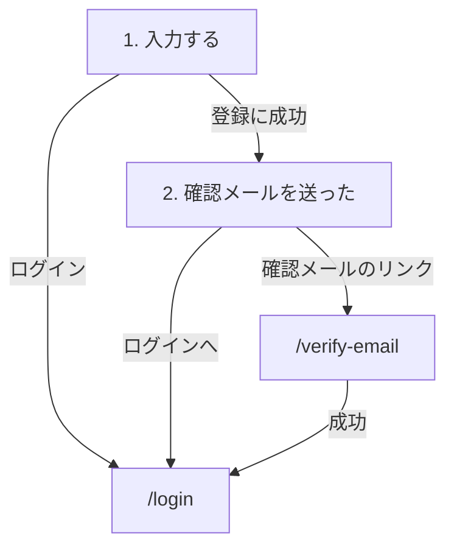

パス: `/signup`。[公開の枠](/pages/user-layout#公開の枠) に入る。

アカウントは、メールアドレスを確認するまでログインに使えない。

## 構成

段階ごとに本体を入れ替え、同じページの中で進む。

### 1. 入力する

上から次の順に置く。

1. 見出し「新規登録」
2. ユーザー名の入力欄
3. メールアドレスの入力欄
4. パスワードの入力欄
5. 「登録する」ボタン
6. 「アカウントをお持ちの方はログイン」

### 2. 確認メールを送った

1. 見出し「確認メールを送りました」
2. メールのリンクを開いて確認を済ませてからログインする、という案内
3. 「ログインへ」

## 状態ごとの表示

- 処理中: 送信ボタンを押せない状態にし、処理中であることを本体の下に出す
- 失敗: 入力欄を残したまま、理由を本体の下に出す

## 登録済みのメールアドレス

画面は新しいアドレスのときと同じく「2. 確認メールを送った」へ進む。そのアドレスへ送るメールはアカウントの状態で変わり、同じアドレスへは 10 分に 1 通までしか送らない。

- 確認済み: 登録済みであることと `/login` へのリンクを載せたメール
- 未確認: 新しいリンクを載せた確認メール

## メールアドレスの確認

パス: `/verify-email`。確認メールのリンクから開く。

| 状態   | 表示                                                               |
| ------ | ------------------------------------------------------------------ |
| 確認中 | 確認していることを出す                                             |
| 成功   | 表示を挟まず `/login` へ移る                                       |
| 失敗   | リンクが無効か期限切れであることと、ログインして再送する案内を出す |

## 遷移

