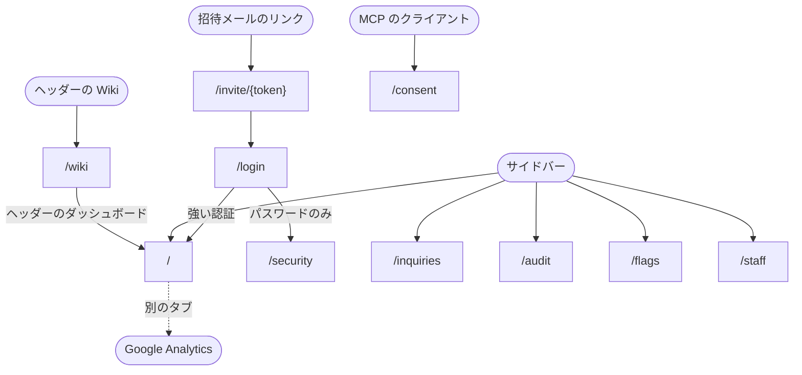

この文書は、目指す画面の構成を書いている。いまの wiki は文書をルートから配るだけで、ダッシュボードの枠と Wiki の枠に分かれるのは [#340](https://github.com/masseater/typescript-template/issues/340) からである。各ページがいまあるかどうかは、表の「状態」の列が示す。

wiki のページは、認証を済ませる前に使う枠、ダッシュボードの枠、Wiki の枠のどれか 1 つに入る。ダッシュボードの枠と Wiki の枠は、強い認証を済ませた社内の利用者にしか表示しない。

## 認証前の枠

ログイン・招待を受ける・MCP のクライアントへの許可に使う。ナビゲーションを持たず、1 つの作業だけを画面中央に置く。

| ページ                     | パス              | 状態                                                                |
| -------------------------- | ----------------- | ------------------------------------------------------------------- |
| ログイン                   | `/login`          | いまある                                                            |
| 招待を受ける               | `/invite/{token}` | [#297](https://github.com/masseater/typescript-template/issues/297) |
| MCP のクライアントへの許可 | `/consent`        | いまある                                                            |

## ダッシュボードの枠

サービスの状況を見るページと、ダッシュボードを使える人の管理に使う。形は [管理者アプリの管理操作の枠](/pages/admin-layout#管理操作の枠) と同じで、違うのは次の点である。

- サイドバーの上端のアプリ名は「社内ダッシュボード」
- 本体の枠のヘッダーの右に、Google Analytics の画面を別のタブで開くリンクと、Wiki の枠へ移る「Wiki」を置く
- Wiki はサイドバーの項目に入れない

| ページ       | パス                            | サイドバー       | 閲覧のみ | 変更できる     | 状態                                                                |
| ------------ | ------------------------------- | ---------------- | -------- | -------------- | ------------------------------------------------------------------- |
| 概要         | `/`                             | 状況・概要       | 見る     | 見る           | [#315](https://github.com/masseater/typescript-template/issues/315) |
| 問い合わせ   | `/inquiries`・`/inquiries/{id}` | 状況・問い合わせ | 見る     | 見る           | [#311](https://github.com/masseater/typescript-template/issues/311) |
| 監査ログ     | `/audit`                        | 状況・監査ログ   | 見る     | 見る           | [#315](https://github.com/masseater/typescript-template/issues/315) |
| 機能フラグ   | `/flags`                        | 運営・機能フラグ | 見る     | 見る・切り替え | [#316](https://github.com/masseater/typescript-template/issues/316) |
| メンバー     | `/staff`                        | 運営・メンバー   | 出さない | 見る・操作     | [#297](https://github.com/masseater/typescript-template/issues/297) |
| セキュリティ | `/security`                     | 下端のメニュー   | 見る     | 見る           | いまある                                                            |

- 概要には、集計の数字のカードと推移のグラフを置く
- 問い合わせは読むだけで、返信は管理者アプリで行う

## Wiki の枠

文書を読むためだけに使う。ダッシュボードの枠とはページの作りが別で、サイドバーを持たない。

- ヘッダー
  - 左に「Wiki」を置き、Wiki の先頭へのリンクにする
  - 右に、文書の検索と、ダッシュボードの枠へ戻る「ダッシュボード」を置く
- 左に文書の木、中央に本文を置く
- 画面幅が狭いときは、文書の木を閉じておき、ヘッダーのメニューボタンで開く

| ページ | パス      | 状態                                                                                                                |
| ------ | --------- | ------------------------------------------------------------------------------------------------------------------- |
| 文書   | `/wiki/…` | いまはルートの下。[#340](https://github.com/masseater/typescript-template/issues/340) で移し、いまの URL は転送する |

## 遷移図

